# Natural Language Processing & LLMs Lecture 01: Introduction to NLP<!-- omit in toc -->

Valentin Malykh, MWS AI

Autumn 2026

The course is delivered at MIPT, HSE (Moscow), and ITMO (Saint Petersburg)

---

- [About the course](#about-the-course)
  - [Acknowledgements](#acknowledgements)
  - [Logistics](#logistics)
  - [Syllabus](#syllabus)
  - [Grading policy](#grading-policy)
  - [Course description](#course-description)
- [2 Research questions and NLP tasks](#2-research-questions-and-nlp-tasks)
  - [Natural language processing in Wikipedia](#natural-language-processing-in-wikipedia)
  - [“Synonyms” of NLP](#synonyms-of-nlp)
  - [NLP as an interdisciplinary study](#nlp-as-an-interdisciplinary-study)
  - [Understanding human languages is not easy](#understanding-human-languages-is-not-easy)
  - [Research questions](#research-questions)
  - [The way of NLP research](#the-way-of-nlp-research)
  - [A brief history of NLP](#a-brief-history-of-nlp)
  - [Holy grails of NLP](#holy-grails-of-nlp)
  - [Accurate machine translation](#accurate-machine-translation)
  - [The Tower of Babel](#the-tower-of-babel)
  - [Free human machine conversation](#free-human-machine-conversation)
  - [Turing test](#turing-test)
  - [Languages, human minds and the world](#languages-human-minds-and-the-world)
  - [NLP Tasks](#nlp-tasks)
  - [NLP methods and tasks](#nlp-methods-and-tasks)
- [3 Grammars and Automata](#3-grammars-and-automata)
  - [How can we define a language?](#how-can-we-define-a-language)
  - [Define a language by an automaton](#define-a-language-by-an-automaton)
  - [Turing machine](#turing-machine)
  - [Finite state automaton / machine (FSA/FSM)](#finite-state-automaton--machine-fsafsm)
- [4 Text segmentation and morphology analysis](#4-text-segmentation-and-morphology-analysis)
  - [Text segmentation](#text-segmentation)
  - [Thai](#thai)
  - [Chinese](#chinese)
  - [English sentence segmentation](#english-sentence-segmentation)
  - [English sentence segmentation — as a classification task](#english-sentence-segmentation--as-a-classification-task)
  - [Chinese word segmentation](#chinese-word-segmentation)
  - [Chinese word segmentation — as a character tagging task](#chinese-word-segmentation--as-a-character-tagging-task)
  - [English word segmentation - Tokenization — An example of Stanford Tokenizer](#english-word-segmentation---tokenization--an-example-of-stanford-tokenizer)
  - [Morphological analysis](#morphological-analysis)
  - [Two slightly different tasks](#two-slightly-different-tasks)
  - [Ambiguity in morphology](#ambiguity-in-morphology)
  - [Language variation](#language-variation)
  - [Ways to combine morphemes to form words](#ways-to-combine-morphemes-to-form-words)
  - [Finite state transducers (FSTs)](#finite-state-transducers-fsts)
  - [English morphology](#english-morphology)
  - [Three components](#three-components)
  - [Rewrite rules](#rewrite-rules)
  - [An example](#an-example)
  - [An FST](#an-fst)
  - [Expanding FST](#expanding-fst)
  - [Representing orthographic rules as FSTs](#representing-orthographic-rules-as-fsts)
  - [Further reading on morphological analysis](#further-reading-on-morphological-analysis)
- [5 Word frequency and collocations](#5-word-frequency-and-collocations)
  - [Top 5000 words in American English](#top-5000-words-in-american-english)
  - [Zipf’s Law](#zipfs-law)
  - [Collocation or multi-word expression (MWE)](#collocation-or-multi-word-expression-mwe)
  - [Criteria for collocations (or MWE)](#criteria-for-collocations-or-mwe)
  - [Non-Compositionality](#non-compositionality)
  - [Non-Modifiability](#non-modifiability)
  - [Metrics for Collocation or MWE Extraction](#metrics-for-collocation-or-mwe-extraction)
  - [Further reading on collocation and MWE](#further-reading-on-collocation-and-mwe)
- [Content](#content)

---

## About the course

### Acknowledgements

- Dr. Qun Liu, Huawei Noah’s Ark lab

- Dr. Constantin Korikov, Huawei Noah’s Ark lab

- Tasnima Sadekova, Huawei Noah’s Ark lab

- Salavat Garifullin, ODS

- Kristina Zheltova, ITMO

- Darya Liutova, ITMO

- students from previous runs

---

### Logistics

- Instructor: Dr. Valentin Malykh

- TAs: Salavat Garifullin for ODS.ai & others

- Lecture Time: 18.50, Tuesdays

- Seminar Time: TBA

- Location: Online

- Slides: will be available at the course platform before each class.

---

### Syllabus

- Introduction

- Word Embeddings

- CNN + Text Classification

- RNN + Tagging

- Machine Translation

- PLM (Encoders)

- LLM (Decoders)

- Agents & Dialog Systems

---

- Project Presentation

- HMMs

- Topic Modeling

- Programming Language Processing

- Reinforcement Learning for NLP

- LLM Compression

- Alternative LLMs

---

### Grading policy

- Quizzes – 8 x 4

- Assignments – 20 x 3

- Final project – 60

---

### Course description

**Natural Language Processing (NLP)** is a domain of research whose objective is to analyze and understand human languages and develop technologies to enable human machine interactions with natural languages. NLP is an interdisciplinary field involving linguistics, computer sciences and artificial intelligence. The goa of this course is to provide students with comprehensive knowledge of NLP. Students will be equipped with the principles and theories of NLP, as well as various NLP technologies, including rule-based, statistical and neural network ones. After this course, students will be able to conduct NLP research and develop state-of-the-art NLP systems.

---

## 2 Research questions and NLP tasks

### Natural language processing in Wikipedia

**Natural language processing (NLP)** is a subfield of linguistics, computer science, information engineering, and artificial intelligence concerned with the interactions between computers and human (natural) languages, in particular how to program computers to process and analyze large amounts of natural language data.

---

### “Synonyms” of NLP

- **Computational Linguistics**

- **Natural Language Processing**

- **Natural Language Understanding**

- **Human Language Technologies**

- Subtleties

  - **Computational Linguistics** is more regarded as a branch of Linguistics, whose main purpose is to understand the mechanism of human languages by means of computing

  - **Natural Language Processing** is a branch of computer sciences and artificial intelligence, whose main purpose is to develop technologies to enable human-computer interactions using human languages

  - **Natural Language Understanding** is one of the two main challenges in Natural Language Processing, while the other is **Natural Language Generation.**

  - **Human Language Technologies** mainly refer to NLP technologies, but may also include other language related technologies, including speech technologies, optical character recognition (OCR), computer typesetting, etc.

---

### NLP as an interdisciplinary study

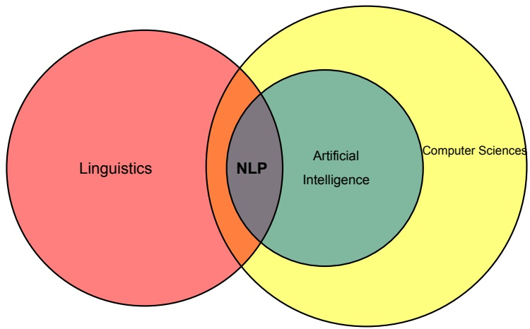

---

### Understanding human languages is not easy

- We are getting used to the fact that human beings can understand each other using language communication.

- Although it is a natural result of evolution for human to obtain the language competence.

- It seems to be a miracle, due to its complexity.

- No other species on this planet can use languages at the degree as humans do.

- The mechanism behind human languages is not fully discovered.

- Understanding human languages by computer is difficult.

---

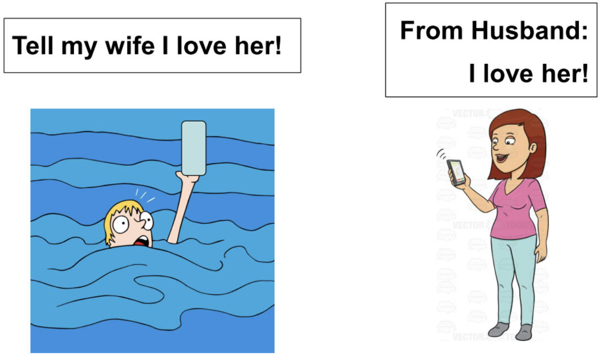

---

### Research questions

- How humans understand each other by using language communication?

- Is it possible to simulate human language behaviors without understanding language mechanisms?

---

### The way of NLP research

- Unlike linguists who develop numerous theories to explain the language mechanisms, NLP researchers try to simulate human language behaviors by computing, not necessarily to understand the language mechanisms.

---

### A brief history of NLP

- 1960s-1990s: Rule-based approaches

- 1990s-2010s: Statistical approaches

- 2010s-present: Neural network (deep learning) approaches

---

### Holy grails of NLP

- Accurate machine translation between human languages

- Free conversation between humans and computers

---

### Accurate machine translation

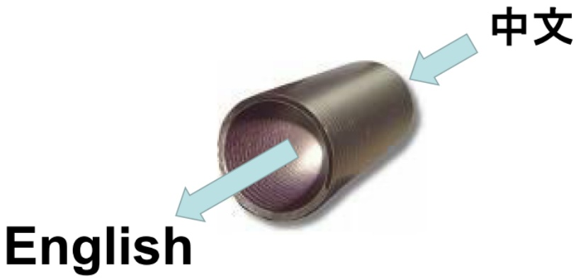

---

### The Tower of Babel

> Oil painting by Pieter Bruegel the Elder, 1563, from Wikipedia

### Free human machine conversation

---

### Turing test

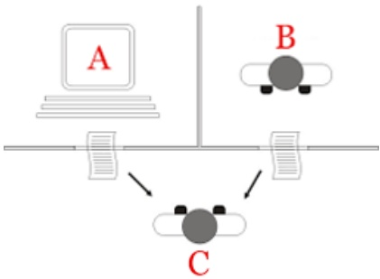

> By Juan Alberto Sánchez Margallo, CC BY 2.5, from Wikipedia

---

### Languages, human minds and the world

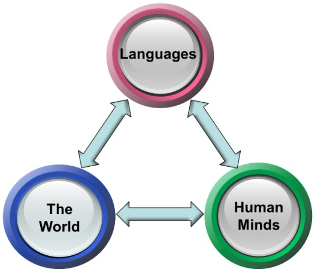

---

### NLP Tasks

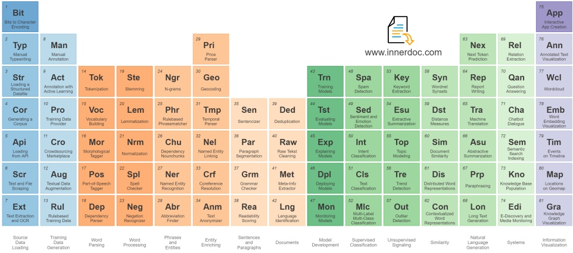

---

### NLP methods and tasks

|  | Classification | Tagging | Generation |
| --- | --- | --- | --- |
| n-grams | TF-IDF | regex | templates |
| word embeddings | word2vec | word2vec |  |
| CNN | CNN | CNN | ConvSeq2Seq |
| RNN | LSTM | LSTM | LSTM |
| Transformers | BERT | BERT | T5 |
| LLM | LLaMA | LLaMA | LLaMA |

---

## 3 Grammars and Automata

### How can we define a language?

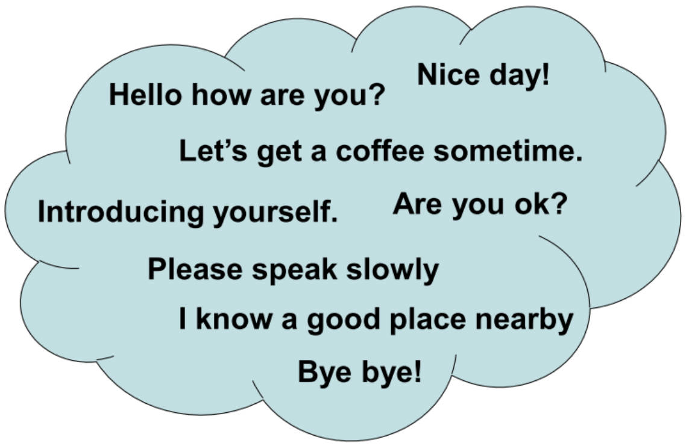

---

- A language can be defined as the set of sentences which can be accepted by the speakers of that language.

- It is not possible to define a natural language by enumerating all the sentences, because the number of sentences in a natural language is infinite.

- Two feasible ways to define a language with infinite sentences:

  - By a Grammar
  - By an Automaton

- In this course, we will not consider grammars: below, languages are defined by automata only.

---

### Define a language by an automaton

- An automaton $A$ is an abstract machine which:

  - Takes a symbol sequence $S$ as input, and determines if $A$ will accept or reject $S$.

  - Has a finite number of states and a finite number of actions.

  - At each time step, $A$ is in a state, and points to a position in $S$.

  - The current state and current symbol determines the action which $A$ will execute, which determines the next state of $A$ and the next position of $S$ where $A$ will point to.

  - Given an input $S$, $A$ will run until it stops, and the final state of $A$ determines if $A$ will accept or reject $S$.

---

- A language $L$ can be defined by an automaton $A$ as:

  - A word sequence $S$ is a sentence of $L$, if and only if: when we input $S$ to $A$, $A$ will stop in a finite number of time steps at an accept state.

---

### Turing machine

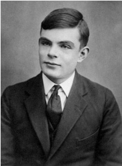

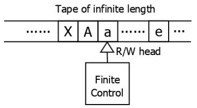

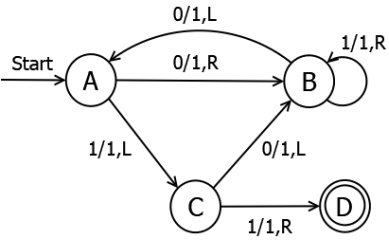

---

- A Turing machine consists of: (to be continued)

  - A *tape* divided into cells, one next to the other. Each cell contains a symbol from some finite alphabet. The alphabet contains a special blank symbol and some other symbols. The tape is assumed to be arbitrarily extendable to the left and to the right.
  
  - A *read/write head* that can read and write symbols on the tape and move the tape left and right one (and only one) cell at a time.

  - A *state register* that stores the state of the Turing machine, one of finitely many. Among these is the special start state with which the state register is initialized.

  - A *finite table* of instructions that, given the state the machine is currently in and the symbol it is reading on the tape, tells the machine to do the following in sequence:

    - Either erase or write a symbol.
    - Move the head to the left or right cell.
    - Assume the same or a new state as prescribed.

---

### Finite state automaton / machine (FSA/FSM)

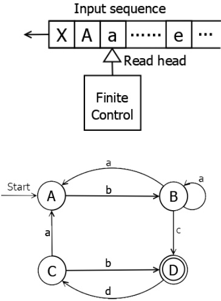

---

- A Finite State Automaton (FSA), or Finite State Machine (FSM), consists of:

  - A finite number of states, while the FSM can be in one state at each given time;

  - A head which reads a symbol from a sequence of symbols as the input. The head always goes to the next symbol at the next time step;

  - A transition matrix which determines the next states of the FSM according to the current states and the current symbol.

---

## 4 Text segmentation and morphology analysis

### Text segmentation

- In NLP, text is segmented into units of various granularities, which include:

  - Chapters and sections;
  - Paragraphs;
  - Sentences;
  - Clauses;
  - Phrases;
  - Words;
  - Morphemes (stems, suffixes, prefixes).

---

- Text segmentation is not straightforward in many cases:

  - For languages like Chinese, Japanese, Tibetan, Thai, there are no spaces between words;

  - For languages like Thai and Tibetan, the delimiters between sentences, clauses or phrases are ambiguous, which makes it hard to segment sentences;

  - Even for English, sentence segmentation is not a trivial task, because the full stop mark (.) is also used for abbreviations, decimals, etc., which may or may not terminate a sentence.

---

### Thai

> โลกเราเป็นอะไรหนอในช่วงนี ส่งหนึ่งของโลกมีอากาศ อันแปรปรวนวิปริต หนาวเหน็บอย่างไม่เคยเกิดขนมาก่อน และยังเกิดแม่นดินพิโรธโกรธาคร่าชีวิตคนไปเปีนเรือนแสน ส่วนบ้านเรานั้นในปีที่ม่านมาแทบไม่มีฤดูหนาวให้ชื่นใจกันเลย อากาศกลับร้อน แถมมีทั้งฝนหลงฤดูในช่วงนี้อีกต่างหาก ทุกคนพูดว่า เป็นเพราะภาวะโลกร้อนนั่นเองททำให้ทุกอย่าง ดูไม่เหมือนเดิม ประเทศที่มีอากาศหนาวก็หนาวลุดขั้ว ประเทศ

Spaces are not reliable boundaries between sentences.

---

### Chinese

> 西游记 4 真假猴王
> 
> 师徒四人继续西行。有一天，他们来到一个地方，前面是望不到边的水面，唐僧发愁（chóu）道:“这么大的水，怎么过去呢？”  
> 
> 四个人正不知道怎么办，忽然看见远处好像有一个人在河边，于是就走过去，想问一问。  
> 
> 走近了一看，那不是一个人，而是一块石头，石头上写着三个大字“通天河”，旁边还有一行小字— “河宽（kuān）八百里，自古少人行”，意思是这条河有八百里宽，很少有人能通过。

There are not spaces between words.

---

### English sentence segmentation

- Dot marks (.) are ambiguous:

  - Full stop: This is an apple.
  - Decimal: 235.6
  - Abbreviations: U.S. Ph.D. etc.
  - A dot mark can take multiple roles: He comes from U.S.

- To segment English text into sentences, we need to determine whether a dot mark is an end of sentence or not.

- It can be solved as a classification problem.

---

### English sentence segmentation — as a classification task

He comes from U.S. She comes from Australia.   
He comes from U.S. with his friends.

**No**: the dot is not an end of a sentence   
**Yes**: the dot is an end of a sentence

---

### Chinese word segmentation

(a)
|   |   |
|---|---|
| 下雨天留客天留我不留 | Unpunctuated Chinese sentence |
| 下雨、天留客。天留、我不留! | It is raining, the god would like the guest to stay. Although the god wants you to stay, I do not! |
| 下雨天、留客天。留我不?留! | The rainy day, the staying day. Would you like me to stay? Sure! |

(b)
|   |   |
|---|---|
| 我喜欢新西兰花 | Unsegmented Chinese sentence |
| 我 喜欢 新西兰 花 | I like New Zealand flowers |
| 我 喜欢 新 西兰花 | I like fresh broccoli |

> http://what-when-how.com/how-to-build-a-digital-library/word-segmentation-and-sorting-digital-library/

Chinese word segmentation may result in different meanings.

---

### Chinese word segmentation — as a character tagging task

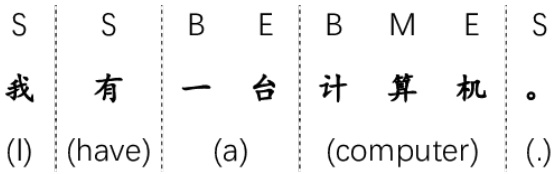

> Wang & Xu, Convolutional Neural Network with Word Embeddings for Chinese Word Segmentation, IJCNLP 2017

Tags:

- S: single character word
- B: beginning character of a word
- M: middle character of a word
- E: end character of a word

---

### English word segmentation - Tokenization — An example of Stanford Tokenizer

**Input**

Another ex-Golden Stater, Paul Stankowski from Oxnard, is contending for a berth on the U.S. Ryder Cup team after winning his first PGA Tour event last year and staying within three strokes of the lead through three rounds of last month’s U.S. Open. H.J. Heinz Company said it completed the sale of its Ore-Ida frozen-food business catering to the service industry to McCain Foods Ltd. for about \$500 million. It’s the first group action of its kind in Britain and one of only a handful of lawsuits against tobacco companies outside the U.S.

**Note:** Text in red: change, text in blue: Keep

---

**Output**

Another ex-Golden Stater , Paul Stankowski from Oxnard , is contending for a berth on the U.S. Ryder Cup team after winning his first PGA Tour event last year and staying within three strokes of the lead through three rounds of last month ’s U.S. Open . H.J. Heinz Company said it completed the sale of its Ore-Ida frozen-food business catering to the service industry to McCain Foods Ltd. for about \$ 500 million . It ’s the first group action of its kind in Britain and one of only a handful of lawsuits against tobacco companies outside the U.S. .

**Note:** Text in red: change, text in blue: Keep

---

### Morphological analysis

- To break words down into component morphemes and build a structured representation

- A morpheme is the minimal meaning-bearing unit in a language.

  - **Stem**: the morpheme that forms the central meaning unit in a word

  - **Affix**: prefix, suffix, infix, circumfix

    - **Prefix**: e.g., possible → impossible

    - **Suffix**: e.g., walk → walking

    - **Infix**: e.g., hingi → humingi (Tagalog)

    - **Circumfix**: e.g., sagen → gesagt (German)

---

### Two slightly different tasks

- Stemming:

  - Ex: writing → writ + ing

- Lemmatization:

  - Ex1: writing → write +V +Prog
  - Ex2: books → book +N +Pl
  - Ex3: writes → write +V +3Per +Sg

---

### Ambiguity in morphology

- flies → fly + N + PL

- flies → fly +V +3rd +Sg

> By Jean and Fred, CC BY 2.0, from Wikimedia Commons

---

### Language variation

- Analytic languages: e.g., Chinese; English as a language with analytic tendency.

- Synthetic flexive languages: e.g., Russian

- Synthetic agglutinate languages: e.g., Turkish

### Ways to combine morphemes to form words

- Inflection: stem + gram. morpheme → same class

  - Ex: help + ed → helped

- Derivation: stem + gram. morpheme → different class 
  
  - Ex: civil + -ization → civilization

- Compounding: multiple stems

  - Ex: cabdriver, doghouse

- Cliticization: stem + clitic

  - Ex: they’ll, she’s (\*I don’t know who she is)

---

### Finite state transducers (FSTs)

- Finite State Transducers are an extension to Finite State Machines, where an output symbol will be given for each input symbol.

- FSTs are commonly used tools for morphological analysis.

- A FST can be used in an inverse direction with the input and the output swapped.

---

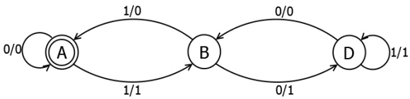

| input | output |
| --- | --- |
| 0 | 0 |
| 11 | 01 |
| 110 | 010 |
| 1001 | 0011 |
| 1100 | 0100 |
| 1111 | 0101 |
| 10010 | 00110 |

---

### English morphology

- Affixes: prefixes, suffixes; no infixes, no circumfixes.

- Inflectional:
  - Noun: -s
  - Verbs: -s, -ing, -ed, -en
  - Adjectives: -er, -est

- Derivational:
  - Ex: V + suf → N  
    computerize + -ation → computerization  
    kill + er → killer

- Compound: pickup, database, heartbroken, etc.

- Cliticization: ’m, ’ve, ’re, etc.

---

### Three components

- Lexicon: the list of stems and affixes, with associated features.
  - Ex1: book: N
  - Ex2: -s + PL

- Morphotactics:
  - Ex: +PL follows a noun

- Orthographic rules (spelling rules): to handle exceptions that can be dealt with by rules.
  - Ex3: $\epsilon$ → e / x ˆ \_ s#

---

### Rewrite rules

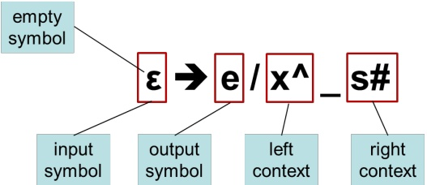

---

### An example

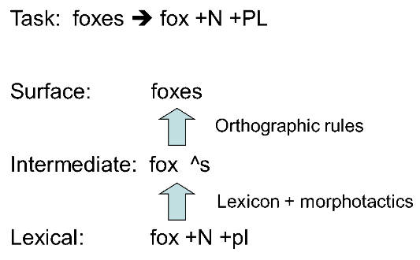

---

### An FST

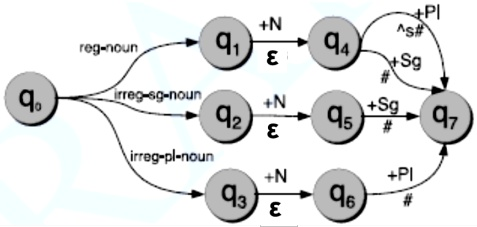

cat +N +PL → cat ˆs #  

cat +N +Sg → cat #

---

### Expanding FST

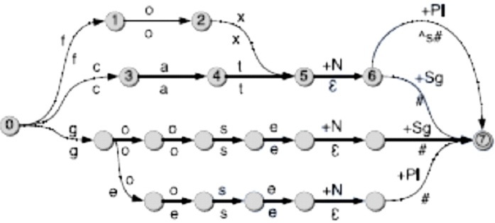

fox +N +PL → fox ˆ s #

cat +N +PL → cat ˆ s #

goose +N +Sg → goose #

goose +N +PL → geese #

---

### Representing orthographic rules as FSTs

ϵ → e / (s|x|z) ˆ \_ s #

Input: ... (s|x|z) ˆ s# immediate level

Output: ... (s|x|z)es # surface level

To reject (fox ˆs, foxs)

---

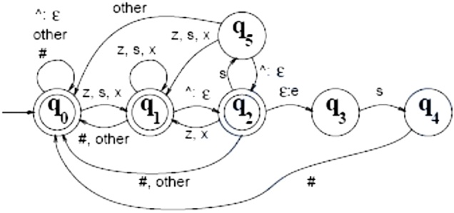

(fox, fox): q0, q0, q0, q1

(fox#, fox#): q0, q0, q0, q1, q0

(foxˆz#, foxz#): q0, q0, q0, q1, q2, q1, q0

(foxˆs#, foxes#): q0, q0, q0, q1, q2, q3, q4, q0

(foxˆs, foxs): q0, q0, q0, q1, q2, q5

---

### Further reading on morphological analysis

Fei Xia, slides on morphological analysis

> https://www.powershow.com/viewfl/6a39a-ZDc1Z/Morphological\_analysis\_powerpoint\_ppt\_presentation

Mans Hulden (2011), Morphological analysis with FSTs

> https://fomafst.github.io/morphtut.html

---

## 5 Word frequency and collocations

### Top 5000 words in American English

| Rank | Word | Part of speech | Frequency | Dispersion |
| --- | --- | --- | --- | --- |
| 1 | the | a | 22038615 | 0.98 |
| 2 | be | v | 12545825 | 0.97 |
| 3 | and | c | 10741073 | 0.99 |
| 4 | of | i | 10343885 | 0.97 |
| 5 | a | a | 10144200 | 0.98 |
| 6 | in | i | 6996437 | 0.98 |
| 7 | to | t | 6332195 | 0.98 |
| 8 | have | v | 4303955 | 0.97 |
| 9 | to | i | 3856916 | 0.99 |
| 10 | it | p | 3872477 | 0.96 |

Statistics from the Corpus of Contemporary American English

> http://www.wordfrequency.info/

---

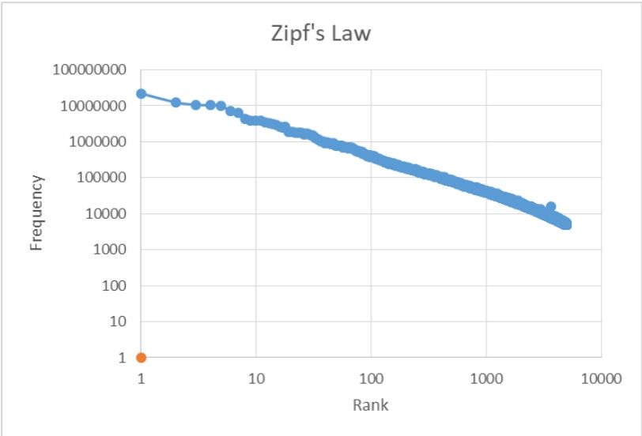

---

### Zipf’s Law

The frequency of any word is inversely proportional to its rank in the frequency table:

$$
p (w _ {r}) \propto \frac {1}{r}
$$

---

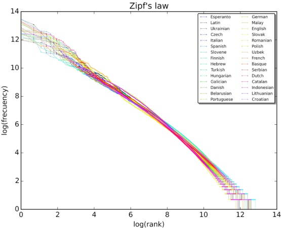

A plot of the rank versus frequency for the first 10 million words in 30 Wikipedias (dumps from October 2015) in a log-log scale.

> (By SergioJimenez - Own work, CC BY-SA 4.0, from Wikipedia)

---

### Collocation or multi-word expression (MWE)

- A COLLOCATION is an expression consisting of two or more words that correspond to some conventional way of saying things.

- The words together can mean more than their sum of parts
  - The Times of India, disk drive
  - hot dog, mother in law

---

- Examples of collocations
  - noun phrases like *strong tea* and *weapons of mass destruction*  
  - phrasal verbs like to *make up*, and other phrases like the *rich and powerful.*

- Valid or invalid?
- *a stiff breeze* but not a *stiff wind* (while either a *strong breeze* or a *strong wind* is okay).  
- *broad daylight* (but not bright daylight or narrow darkness).

---

### Criteria for collocations (or MWE)

- Typical criteria for collocations:
  - non-compositionality
  - non-substitutability
  - non-modifiability.

- Collocations usually cannot be translated into other languages word by word.

- A phrase can be a collocation even if it is not consecutive (as in the example *knock ... door*).

---

### Non-Compositionality

- A phrase is compositional if the meaning can be predicted from the meaning of the parts.
  - E.g. new companies

- A phrase is non-compositional if the meaning cannot be predicted from the meaning of the parts
  - E.g. hot dog

---

- Collocations are not necessarily fully compositional in that there is usually an element of meaning added to the combination.
  - E.g. *strong tea*

- Idioms are the most extreme examples of non-compositionality
  - E.g. *to hear it through the grapevine*

---

- We cannot substitute near-synonyms for the components of a collocation.

- For example
  - We can’t say *yellow wine* instead of **white wine** even though *yellow* is as good a description of the color of *white* wine as white is (it is kind of a yellowish white).

---

### Non-Modifiability

- Many collocations cannot be freely modified with additional lexical material or through grammatical transformations (Non-modifiability).
  - E.g. *white wine*, but not *whiter wine*
  - E.g. *mother in law*, but not *mother in laws*

---

### Metrics for Collocation or MWE Extraction

- Frequency

- Mean and Variance of Distances between Words

- Hypothesis Testing
  - t-test
  - $\chi ^ { 2 }$ test
  - likelihood ratio test

- Mutual Information

- Left and Right Context Entropy

- C-Value

### Further reading on collocation and MWE

- Manning & Schütze, Fundamentals of Statistical Natural Language Processing, 1999, Chapter 3 (A general introduction to collocation)

- Katerina T. Frantzi, Sophia Ananiadou, Junichi Tsujii, The C-value / NC-value Method of Automatic Recognition for Multi-word Terms, ECDL 1998: Research and Advanced Technology for Digital Libraries pp 585-604 (proposed the C-value metric)

- Zhiyong Luo, Rou Song, An integrated method for Chinese unknown word extraction, SIGHAN 2004. Barcelona, Spain. (proposed the context entropy method)

## Content

1. **About the course**
   
2. **Research questions and NLP tasks**
   
3. **Grammars and Automata**
   
4. **Text segmentation and morphology analysis**
   
5. **Word frequency and collocations**