# Natural Language Processing & LLMs Lecture 02: Word Embeddings <!-- omit in toc -->

Valentin Malykh, MWS AI

Spring 2026

The course is delivered at MIPT, HSE (Moscow), and ITMO (Saint Petersburg)

---

- [1 Distributional semantics](#1-distributional-semantics)
    - [Word representations](#word-representations)
    - [Representing words by their context](#representing-words-by-their-context)
    - [Distributional semantics](#distributional-semantics)
    - [Distributional semantic models](#distributional-semantic-models)
    - [Example: Window based co-occurrence matrix](#example-window-based-co-occurrence-matrix)
    - [Problems with simple co-occurrence vectors](#problems-with-simple-co-occurrence-vectors)
    - [Solution: Low dimensional vectors](#solution-low-dimensional-vectors)
    - [Method: Dimensionality ReductionMethod: Dimensionality Reduction](#method-dimensionality-reductionmethod-dimensionality-reduction)
    - [Simple SVD word vectors in Python](#simple-svd-word-vectors-in-python)
    - [Hacks to X (several used in Rohde et al. 2005)](#hacks-to-x-several-used-in-rohde-et-al-2005)
    - [Interesting syntactic patterns emerge in the vectors](#interesting-syntactic-patterns-emerge-in-the-vectors)
- [2 Word embeddings](#2-word-embeddings)
    - [Count-based representations](#count-based-representations)
    - [Prediction-based representations](#prediction-based-representations)
    - [Word embeddings](#word-embeddings)
- [3 Word2Vec](#3-word2vec)
  - [3 Word2Vec - Basic idea](#3-word2vec---basic-idea)
    - [Word2vec: Overview](#word2vec-overview)
  - [3 Word2Vec - Logistic regression: a refresher](#3-word2vec---logistic-regression-a-refresher)
    - [Logistic regression: a refresher](#logistic-regression-a-refresher)
    - [Optimization: Gradient Descent](#optimization-gradient-descent)
    - [Gradient Descent](#gradient-descent)
    - [Stochastic Gradient Descent](#stochastic-gradient-descent)
    - [Model as a logistic function](#model-as-a-logistic-function)
    - [Cost function for Logistic regression](#cost-function-for-logistic-regression)
    - [Gradient descent for Logistic regression](#gradient-descent-for-logistic-regression)
  - [3 Word2Vec - Cross-entropy loss function](#3-word2vec---cross-entropy-loss-function)
    - [Word2vec: objective function](#word2vec-objective-function)
    - [Cross-entropy loss function](#cross-entropy-loss-function)
    - [Word2vec: objective function](#word2vec-objective-function-1)
    - [Word2Vec Overview with Vectors](#word2vec-overview-with-vectors)
  - [3 Word2Vec - Softmax](#3-word2vec---softmax)
    - [Word2vec: prediction function](#word2vec-prediction-function)
    - [Softmax](#softmax)
  - [3 Word2Vec - Derivation of gradients](#3-word2vec---derivation-of-gradients)
    - [Derivation of gradients for Word2Vec model](#derivation-of-gradients-for-word2vec-model)
    - [Derivation of gradients for Word2Vec model](#derivation-of-gradients-for-word2vec-model-1)
  - [3 Word2Vec - Stochastic Gradient Descent](#3-word2vec---stochastic-gradient-descent)
    - [To train the model: Compute all vector gradients!](#to-train-the-model-compute-all-vector-gradients)
    - [Stochastic gradients with word vectors!](#stochastic-gradients-with-word-vectors)
  - [3 Word2Vec - More details](#3-word2vec---more-details)
    - [Word2vec: More details](#word2vec-more-details)
    - [Skip-gram Model vs. CBOW Model](#skip-gram-model-vs-cbow-model)
    - [Negative Sampling](#negative-sampling)
- [4 Evaluation of word embeddings](#4-evaluation-of-word-embeddings)
    - [How to evaluate word vectors?](#how-to-evaluate-word-vectors)
    - [Intrinsic word vector evaluation](#intrinsic-word-vector-evaluation)
    - [GloVe Visualizations](#glove-visualizations)
    - [GloVe Visualizations: Company - CEO](#glove-visualizations-company---ceo)
    - [GloVe Visualizations: Superlatives](#glove-visualizations-superlatives)
    - [Analogy evaluation and hyperparameters](#analogy-evaluation-and-hyperparameters)
    - [Another intrinsic word vector evaluation](#another-intrinsic-word-vector-evaluation)
  - [Correlation evaluation](#correlation-evaluation)
    - [Extrinsic word vector evaluation](#extrinsic-word-vector-evaluation)
- [5 fastText](#5-fasttext)
    - [Limitation of Skip-Gram](#limitation-of-skip-gram)
    - [Example](#example)
    - [Character n-gram based model](#character-n-gram-based-model)
    - [Character n-gram based model (cont’d)](#character-n-gram-based-model-contd)
    - [Computing word vector representation](#computing-word-vector-representation)
    - [Experiments Settings](#experiments-settings)
    - [Human similarity judgement](#human-similarity-judgement)
    - [Word analogy tasks](#word-analogy-tasks)
    - [Comparison with morphological representations](#comparison-with-morphological-representations)
    - [Effect of the size of the training data](#effect-of-the-size-of-the-training-data)
    - [Effect of the size of n-grams](#effect-of-the-size-of-n-grams)
    - [Conclusion](#conclusion)
- [Content](#content)


---

## 1 Distributional semantics

#### Word representations

- In rule-based approaches, i.e., grammars, automata, etc., words are represented as symbols.

- However, if we want to apply machine learning algorithms, we should represent linguistic units (words, phrases, etc.) as numerical vectors.

- Then the question is, how can we represent words as numerical vectors?

---

#### Representing words by their context

“You shall know a word by the company it keeps”


(J. R. Firth, 1957)

- Distributional hypothesis:  
  Linguistic items with similar distributions have similar meanings.  
  ⇒ **Distributional Semantics**

---

#### Distributional semantics

- Distributional semantics is a research area that develops and studies theories and methods for quantifying and categorizing semantic similarities between linguistic items based on their distributional properties in large samples of language data. (Wikipedia)

- Idea: Collect distributional information in high-dimensional vectors, and define distributional/semantic similarity in terms of vector similarity.

|   |   |   |
| --- | --- | --- | 
| when the door opened and | Doctor | Livesey came in on |
| visit to my father Oh | doctor | we cried what shall |
| s end ! said the | doctor | No more wounded than |
| back with the basin the | doctor | had already ripped up |
| great spirit Prophetic said the | doctor | touching this picture with |
| him First he recognized the | doctor | with an unmistakable frown |

A sample of concordance

---

#### Distributional semantic models

- Distributional semantic models differ primarily with respect to the following parameters:

  - Context type (text regions vs. linguistic items)

  - Context window (size, extension, etc.)

  - Frequency weighting (e.g. entropy, pointwise mutual information, etc.)

  - Dimension reduction (e.g. random indexing, singular value decomposition, etc.)

  - Similarity measure (e.g. cosine similarity, Minkowski distance, etc.)

---

#### Example: Window based co-occurrence matrix

- Window length 1 (more common: 5–10)

- Symmetric (irrelevant whether left or right context)

- Example corpus:

  - I like deep learning.
  - I like NLP.
  - I enjoy flying.

| COUNTS | I | LIKE | ENJOY | DEEP | LEARNING | NLP | FLYING | . |
| --- | --- | --- | --- | --- | --- | --- | --- | --- |
| I | 0 | 2 | 1 | 0 | 0 | 0 | 0 | 0 |
| LIKE | 2 | 0 | 0 | 1 | 0 | 1 | 0 | 0 |
| ENJOY | 1 | 0 | 0 | 0 | 0 | 0 | 1 | 0 |
| DEEP | 0 | 1 | 0 | 0 | 1 | 0 | 0 | 0 |
| LEARNING | 0 | 0 | 0 | 1 | 0 | 0 | 0 | 1 |
| NLP | 0 | 1 | 0 | 0 | 0 | 0 | 0 | 1 |
| FLYING | 0 | 0 | 1 | 0 | 0 | 0 | 0 | 1 |
| . | 0 | 0 | 0 | 0 | 1 | 1 | 1 | 0 |

---

#### Problems with simple co-occurrence vectors

- Increase in size with vocabulary

- Very high dimensional: requires a lot of storage

- Subsequent classification models have sparsity issues ⇒ models are less robust

#### Solution: Low dimensional vectors

- Idea: store "most" of the important information in a fixed, small number of dimensions: a dense vector

  - Usually 25–1000 dimensions, similar to word2vec

- How to reduce the dimensionality?

---

#### Method: Dimensionality ReductionMethod: Dimensionality Reduction

Singular Value Decomposition of co-occurrence matrix $X$

Factorizes $X$ into $U \Sigma V^T$ , where $U$ and $V$ are orthonormal

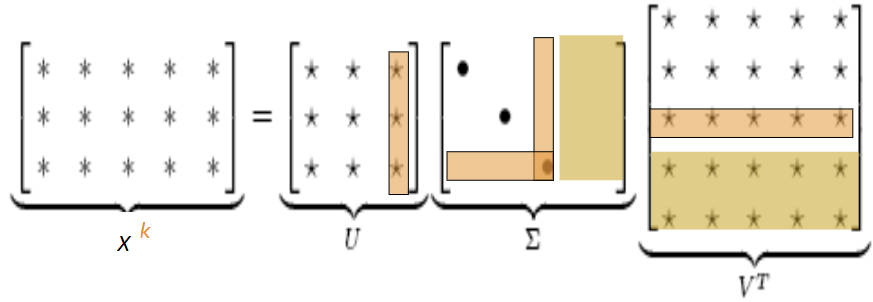

Retain only $k$ singular values, in order to generalize.  
$\hat { X }$ is the best rank $k$ approximation to $X$, in terms of least squares.  
Classic linear algebra result. Expensive to compute for large matrices.

> Christopher Manning, Natural Language Processing with Deep Learning, Stanford U. CS224n

---

#### Simple SVD word vectors in Python

Corpus:  
I like deep learning. I like NLP. I enjoy flying.

```python
import numpy as np
la = np.linalg
words = ["I", "like", "enjoy",
         "deep","learnig","NLP","flying","."]
X = np.array([[0,2,1,0,0,0,0,0],
            [2,0,0,1,0,1,0,0],
            [1,0,0,0,0,0,1,0],
            [0,1,0,0,1,0,0,0],
            [0,0,0,1,0,0,0,1],
            [0,1,0,0,0,0,0,1],
            [0,0,1,0,0,0,0,1],
            [0,0,0,0,1,1,1,0]])
U, s, Vh = la.svd(X, full_matrices=False)
```

> Christopher Manning, Natural Language Processing with Deep Learning, Stanford U. CS224n

---

Corpus: I like deep learning. I like NLP. I enjoy flying.  
Printing first two columns of U corresponding to the 2 biggest singular values

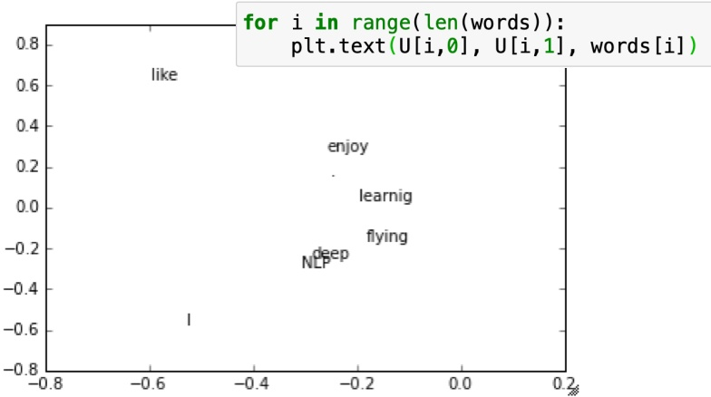

> Christopher Manning, Natural Language Processing with Deep Learning, Stanford U. CS224n

---

#### Hacks to X (several used in Rohde et al. 2005)

Scaling the counts in the cells can help a lot

- Problem: function words (the, he, has) are too frequent ⇒ syntax has too much impact. Some fixes:

  - $\min(X, t)$, with $t \approx 100$
  - Ignore them all

- Ramped windows that count closer words more

- Use Pearson correlations instead of counts, then set negative values to 0

- Etc.

---

#### Interesting syntactic patterns emerge in the vectors

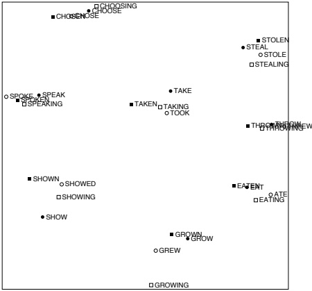

COALS model from  
An Improved Model of Semantic Similarity Based on Lexical Co-Occurrence Rohde et al. ms., 2005  
> Christopher Manning, Natural Language Processing with Deep Learning, Stanford U. CS224n

---

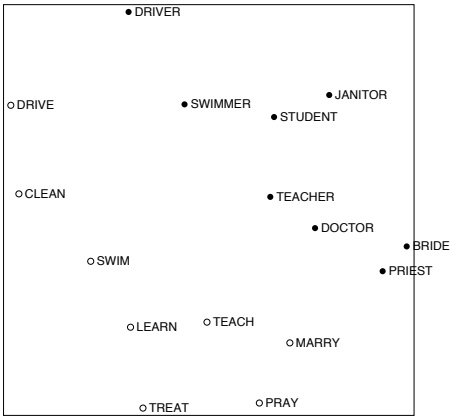

Figure 13: MCOALS model from

An Improved Model of Semantic Similarity Based on Lexical Co-Occurrence Rohde et al. ms., 2005

**point mind monopoly cardboard lipstick leningrad**Christopher Manning, Natural Language Processing with Deep Learning, Stanford U. CS224n

## 2 Word embeddings

#### Count-based representations

- The vectors used in distributional semantics are based on frequencies, which are also called count-based representations.

- Count-based representations were successful in many similarity-related tasks, however, they could not be extended to other NLP tasks.

- In order to take full advantage of machine learning / deep learning approaches, it is necessary to represent words solely in vectors. In other words, we must use vectors to replace words completely, and get rid of symbols in computing, except for the output layer.

---

#### Prediction-based representations

- If a word can be predicted by the vectors of its content words, then we can expect we can use the vectors to replace the words in any NLP tasks.
- Prediction-based word representations:
  - Randomly assign a vector to each word in the vocabulary;
  - Prepare a corpus;
  - For each word (referred to as the current word) in the corpus, repeat:
    - Calculate the probability of all content words given the current word (or vice versa);
    - Adjust the word vectors to maximize the above probability.

---

#### Word embeddings

- Various prediction-based word representations, or word embeddings, are developed, including:
  - Word2Vec, GloVe, FastText, etc.
- Word embeddings are the first step towards deep learning (neural network) based NLP
- In some cases, the pretrained word embeddings (like Word2Vec) can be directly used to solve NLP problems.
- However, this is not always the case.
- Instead, word embeddings are defined as components of the whole NLP system, whose parameters are tuned together with all other parameters.

## 3 Word2Vec

- T Mikolov, I Sutskever, K Chen, GS Corrado, J Dean, Distributed representations of words and phrases and their compositionality, NIPS 2013

  - Word2Vec (include Skip-gram (SG) and Continuous Bag of Words (CBOW))

- Y Goldberg, O Levy. word2vec Explained: deriving Mikolov et al.’s negative-sampling word-embedding method. arXiv:1402.3722

- A Joulin, É Grave, P Bojanowski, T Mikolov, Bag of Tricks for Efficient Text Classification. EACL 2017.

  - FastText


Tomas Mikolov

---

### 3 Word2Vec - Basic idea

#### Word2vec: Overview

- Word2vec (Mikolov et al. 2013) is a framework for learning word vectors

- Idea:
  - We have a large corpus of text
  - Every word in a fixed vocabulary is represented by a vector
  - Go through each position t in the text, which has a center word c and context (“outside”) words o
  - Use the similarity of the word vectors for c and o to calculate the probability of o given c (or vice versa)
  - Keep adjusting the word vectors to maximize this probability

---

- Example windows and process for computing $P(w_{t+j} | w_{t})$

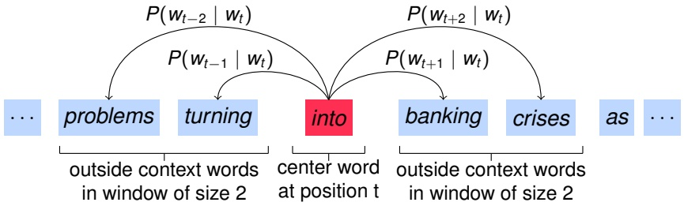

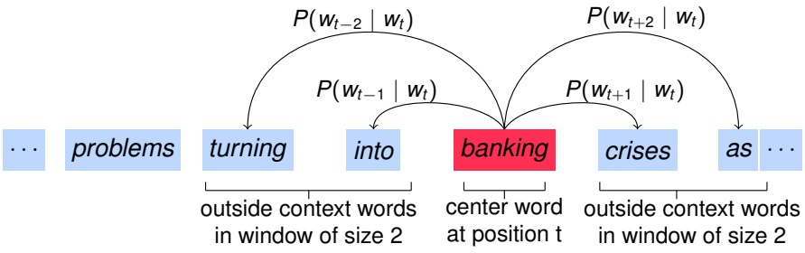

outside context words in window of size 2   
center word at position t  
outside context words in window of size 2  

---

### 3 Word2Vec - Logistic regression: a refresher

#### Logistic regression: a refresher

- Training word2vec relies on two machine learning tools:
  - gradient descent
  - a logistic regression model and its cost function

---

#### Optimization: Gradient Descent

- We have a cost function $J ( \theta )$ we want to minimize

- Gradient Descent is an algorithm to minimize $J ( \theta )$

- Idea: for current value of θ, calculate gradient of J(θ), then take small step in direction of negative gradient. Repeat.

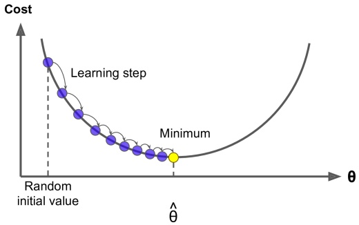

> Christopher Manning, Natural Language Processing with Deep Learning, Stanford U. CS224n

---

#### Gradient Descent

- Update equation (in matrix notation):

  $$
  \theta^{\text{new}} = \theta^{\text {old}} - \alpha \nabla_{\theta} J (\theta)
  $$

  where $\alpha =$ step size or learning rate

- Update equation (for single parameter):

  $$
  \theta_{j}^{\text {new}} = \theta_{j}^{\text {old}} - \alpha \frac{\partial}{\partial \theta_{j}^{\text{old}}} J(\theta)
  $$

**Algorithm:**

```python
while True:
    theta_grad = evaluate_gradient(J,corpus,theta)
    theta = theta - alpha * theta_grad
```

---

#### Stochastic Gradient Descent

- Problem: $J(θ)$ is a function of all windows in the corpus (potentially billions!)

- So $\nabla _ { \theta } J ( \theta )$ is very expensive to compute

- You would wait a very long time before making a single update!

- Very bad idea for pretty much all neural nets!

- Solution: Stochastic gradient descent (SGD)

- Repeatedly sample windows, and update after each one

**Algorithm:**

```python
while True:
  window = sample_window(corpus)
  theta_grad = evaluate_gradient(J,window,theta)
  theta = theta - alpha * theta_grad
```

---

#### Model as a logistic function

$$
h _ {\theta} (x) = \text {Logistic} (d _ {\theta} (x)) = \frac {1}{1 + e ^ {- d _ {\theta} (x)}} = \frac {1}{1 + e ^ {- \theta^ {T} x}}
$$

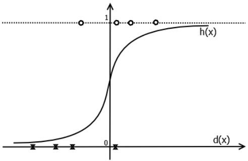

---

#### Cost function for Logistic regression

$$
J (\theta) = \frac {1}{n} \sum_ {i = 1} ^ {n} \operatorname{Cost} \left(h _ {\theta} \left(x ^ {\{i \}}\right), y ^ {\{i \}}\right)
$$

where:

$$
\begin{split} 
  \text {Cost} (h_{\theta}(x), y) &= 
    \begin{cases}
      - \log (h _ {\theta} (x)) & \text {if } y = 1 \\
      - \log (1 - h _ {\theta} (x)) & \text {if } y = 0 
    \end{cases} \\
  &= - [ y \log (h _ {\theta} (x)) + (1 - y) \log (1 - h _ {\theta} (x)) ] \\
  y ^ {\{* \}} \in \{0, 1 \} 
\end{split}
$$

---

#### Gradient descent for Logistic regression

$$
J (\theta) = - \frac {1}{n} \sum_ {i = 1} ^ {n} \left[ y ^ {\{i \}} \log (h _ {\theta} (x ^ {\{i \}})) + (1 - y ^ {\{i \}}) \log (1 - h _ {\theta} (x ^ {\{i \}})) \right]
$$

$$
\begin{split} 
  \frac {\partial}{\partial \theta_ {j}} J (\theta) &= - \frac {1}{n} \frac {\partial}{\partial \theta_ {j}} \sum_ {i = 1} ^ {n} \left[ y ^ {\{i \}} \log (h _ {\theta} (x ^ {\{i \}})) + (1 - y ^ {\{i \}}) \log (1 - h _ {\theta} (x ^ {\{i \}})) \right] \\ 
  &= \dots \\ 
  &= \frac {1}{n} \sum_ {i = 1} ^ {n} (h _ {\theta} (x ^ {\{i \}}) - y ^ {\{i \}}) x _ {j} ^ {\{i \}} \end{split}
$$


$$
\text{update: } \theta _ { j } = \theta _ { j } - \alpha   \frac { 1 } { n } \sum _ { i = 1 } ^ { n } ( h _ { \theta } ( x ^ { \{ i \} } ) - y ^ { \{ i \} } ) x _ { j } ^ { \{ i \} } ,
$$

---

### 3 Word2Vec - Cross-entropy loss function

#### Word2vec: objective function

For each position $t = 1, \ldots, T$, predict context words within a window of fixed size m, given center word $w _ { t }$

- Likelihood:

  $$
  L(\theta) = \prod_{t = 1}^{T}\prod_{\substack{-m\leq j\leq m\\ j\neq 0}}P(w_{t + j}\mid w_{t};\theta)
  $$

  (θ is all variables to be optimized)

- The objective function $J ( \theta )$ is the (average) negative log likelihood (sometimes called cost or loss function):

  $$
  J(\theta) = -\frac{1}{T}\log L(\theta) = -\frac{1}{T}\sum_{t = 1}^{T}\sum_{\substack{-m\leq j\leq m\\ j\neq 0}}\log P(w_{t + j}\mid w_{t};\theta)
  $$

- Minimizing objective function $\Leftrightarrow$ Maximizing predictive accuracy

---

#### Cross-entropy loss function

- Negative Log Likelihood Loss:

  $$
  J(\theta) = -\frac{1}{T}\log L(\theta) = -\frac{1}{T}\sum_{t = 1}^{T}\sum_{\substack{-m\leq j\leq m\\ j\neq 0}}\log p(w_{t + j}|w_{t};\theta)
  $$

  is also called Cross-Entropy Loss.

- Cross-entropy is a measure of the difference between two probability distributions for a given random variable or set of events.

---

- Consider two probability distributions $p$ and $q$ defined on a set of events $X = \{x_{1}, x_{2}, . . . ,x_{n} \}$ , then cross-entropy between $p$ and $q$ is:

  $$
  H (q, p) = - \sum_ {x \in X} q (x) \log p (x)
  $$

Assume $X$ is the vocabulary, $p ( x )$ is the probability generated by the model over the vocabulary, $q ( x )$ is the actual distribution of the content word at $t + j !$

$$
q (x) = 
  \begin{cases}
    1, & \text {for } x = w_{t + j} \\ 
    0, & \text {otherwise} 
  \end{cases}
$$

then:

$$
H (q, p) = - \log p \left(w _ {t + j}\right)
$$

---

#### Word2vec: objective function

- We want to minimize the objective function:

  $$
  J(\theta) = -\frac{1}{T}\sum_{t = 1}^{T}\sum_{\substack{-m\leq j\leq m\\ j\neq 0}}\log P(w_{t + j}\mid w_{t};\theta)
  $$

- Question: How to calculate $P ( w _ { t + j }   |   w _ { t } ; \theta ) ?$

- Answer: We will use two vectors per word w:

  - $v _ { w }$ when w is a center word
  - $u _ { W }$ when w is a context word

- Then for a center word c and a context word o:

  $$
  P (o \mid c) = \frac {\exp \left(u _ {o} ^ {T} v _ {c}\right)}{\sum_ {w \in V} \exp \left(u _ {w} ^ {T} v _ {c}\right)}
  $$

---

#### Word2Vec Overview with Vectors

- Example windows and process for computing $P ( w _ { t + j }   |   w _ { t } )$

- $P (u_{problems}\lvert v_{into} )$ short for $P(problems\lvert into; u_{problems} , v_{into} , \theta)$

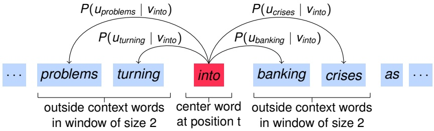

---

### 3 Word2Vec - Softmax

#### Word2vec: prediction function

$$
P (o \mid c) = \frac {\exp \left(u _ {o} ^ {T} v _ {c}\right)}{\sum_ {w \in V} \exp \left(u _ {w} ^ {T} v _ {c}\right)}
$$

1. Dot product compares similarity of $o$ and c: $\begin{array} { r } { \left( \boldsymbol { U } \cdot \boldsymbol { V } = \sum _ { i = 1 } ^ { d } u _ { i } v _ { i } , \right. } \end{array}$ larger dot product = larger probability

2. Exponentiation makes anything positive

3. Normalize over entire vocabulary to give probability distribution

- This is an example of the softmax function $\mathbb{R}^{d}\rightarrow (0, 1)^{d}$

  $$
  \text{softmax} (x_{i}) = \frac{\exp (x_{i})}{\sum_{j = 1}^{d} \exp(x_{j})} = p{i}
  $$

- The softmax function maps arbitrary values $x_{i}$ to a probability distribution $p_{i}$

- “max” because it amplifies probability of the largest $x_{j}$ , “soft” because it still assigns some probability to smaller $x_{i}$

- Frequently used in Deep Learning

---

#### Softmax

- In mathematics, the softmax function, also known as softargmax or normalized exponential function, is a function that takes as input <u>a vector of d real numbers</u>, and <u>normalizes</u> it. We could interpret this as <u>a probability distribution</u> consisting of d probabilities proportional to the exponentials of the input numbers.

- The standard (unit) softmax function softmax : $\mathbb { R } ^ { d } \rightarrow ( 0 , 1 ) ^ { d }$ is defined by the formula:

  $$
  p _ {i} = \frac {\exp (x _ {i})}{\sum_ {j = 1} ^ {d} \exp (x _ {j})} \quad \text {for} i = 1, \dots , d \text {and} x = (x _ {1}, \dots , x _ {d}) \in \mathbb {R} ^ {d}
  $$

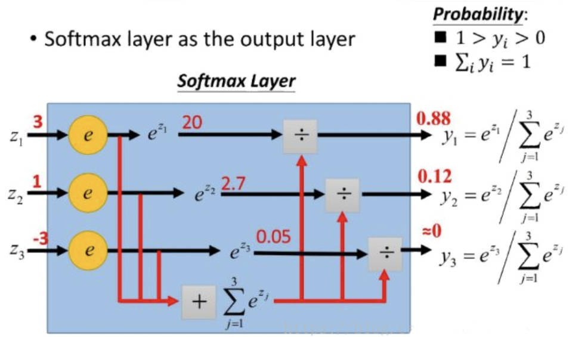

Figure source: https://blog.csdn.net/xg123321123/article/details/80781611

- In Word2Vec, because the softmax function is calculated over all words in the vocabulary, it is quite expensive computationally.

---

### 3 Word2Vec - Derivation of gradients

#### Derivation of gradients for Word2Vec model

$$
\begin{split}
J(\theta) &= -\frac{1}{T}\log L(\theta)\\
&= -\frac{1}{T}\sum_{t = 1}^{T}\sum_{\substack{-m\leq j\leq m\\ j\neq 0}}\log p(w_{t + j}|w_{t};\theta)\\
&= -\frac{1}{T}\sum_{o\in \text{context}(c)}\sum_{c\in \text{corpus}}\log p(o|c;u,v)\\
\frac{\partial}{\partial \theta} J(\theta) &= -\frac{1}{T}\sum_{o\in \text{context}(c)}\sum_{c\in \text{corpus}}\frac{\partial}{\partial\theta}\log p(o|c;u,v) 
\end{split}
$$

---

#### Derivation of gradients for Word2Vec model

$$
\begin{split}
  \frac {\partial}{\partial v _ {c}} \log p (o | c; u, v) &= \frac {\partial}{\partial v _ {c}} \log \frac {\exp (u _ {o} ^ {T} v _ {c})}{\sum_ {w = 1} ^ {V} \exp (u _ {w} ^ {T} v _ {c})} \\
  &= \frac {\partial}{\partial v _ {c}} (u _ {o} ^ {T} v _ {c}) - \frac {\partial}{\partial v _ {c}} \log \sum_ {w = 1} ^ {V} \exp (u _ {w} ^ {T} v _ {c}) \\
  &= u _ {o} - \frac {1}{\sum_ {w = 1} ^ {V} \exp (u _ {w} ^ {T} v _ {c})} \frac {\partial}{\partial v _ {c}} \sum_ {w = 1} ^ {V} \exp (u _ {w} ^ {T} v _ {c}) \\
  &= u _ {o} - \frac {1}{\sum_ {w = 1} ^ {V} \exp (u _ {w} ^ {T} v _ {c})} \sum_ {w = 1} ^ {V} \frac {\partial}{\partial v _ {c}} \exp (u _ {w} ^ {T} v _ {c}) \\
  &= u _ {o} - \frac {1}{\sum_ {w = 1} ^ {V} \exp (u _ {w} ^ {T} v _ {c})} \sum_ {w = 1} ^ {V} \exp (u _ {w} ^ {T} v _ {c}) u _ {w} \\
  &= u _ {o} - \sum_ {x = 1} ^ {V} \frac {\exp (u _ {x} ^ {T} v _ {c})}{\sum_ {w = 1} ^ {V} \exp (u _ {w} ^ {T} v _ {c})} u _ {x} \\
  &= u _ {o} - \sum_ {x = 1} ^ {V} p (x | c) u _ {x}
\end{split}
$$

---

$$
\frac {\partial}{\partial \theta} J (\theta) = - \frac {1}{T} \sum_ {o \in \text {context} (c)} \sum_ {c \in \text {corpus}} \frac {\partial}{\partial \theta} \log p (o | c; u, v)
$$

$$
\frac {\partial}{\partial v _ {c}} J (\theta) = - \frac {1}{T} \sum_ {o \in \text {context} (c)} \sum_ {c \in \text {corpus}} \left[ u _ {o} - \sum_ {x = 1} ^ {V} p (x | c) u _ {x} \right]
$$

$$
\frac {\partial}{\partial u _ {o}} J (\theta) = - \frac {1}{T} \sum_ {o \in \text {context} (c)} \sum_ {c \in \text {corpus}} \left[ v _ {c} - \sum_ {x = 1} ^ {V} p (o | x) v _ {x} \right]
$$

---

- We went through gradient for each center vector v in a window

- We also need gradients for outside vectors u

- Generally in each window we will compute updates for all parameters that are being used in that window. For example:


---

### 3 Word2Vec - Stochastic Gradient Descent

#### To train the model: Compute all vector gradients!

- Recall: $θ$ represents all model parameters, in one long vector

- In our case with $d$-dimensional vectors and $V$-many words:

  $$
  \theta = \left[ 
    \begin{array}{c} 
      V _ {\text {aardvark}} \\
      V _ {a} \\
      \vdots \\
      V _ {\text {zebra}} \\
      U _ {\text {aardvark}} \\
      U _ {a} \\
      \vdots \\
      U _ {\text {zebra}} 
    \end{array} 
  \right] \in \mathbb {R} ^ {2 d V}
  $$

- Remember: every word has two vectors

- We optimize these parameters by walking down the gradient

---

#### Stochastic gradients with word vectors!

- Iteratively take gradients at each such window for SGD

- But in each window, we only have at most $2m + 1$ words, so $\nabla_{\theta } J_{t}(\theta)$ is very sparse!

  $$
  \nabla_ {\theta} J _ {t} (\theta) = \left[ 
    \begin{array}{c} 
      0 \\
      \vdots \\
      \nabla_ {v _ {\text {like}}} \\
      \vdots \\
      0 \\
      \nabla_ {u _ {\mathrm{I}}} \\
      \vdots \\
      \nabla_ {u _ {\text {learning}}} \\
      \vdots 
    \end{array} 
  \right] \in \mathbb {R} ^ {2 d V}
  $$

---

- We might only update the word vectors that actually appear!

- Solution: either you need sparse matrix update operations to only update certain rows of full embedding matrices U and V, or you need to keep around a hash for word vectors

  $$
  V = \left[ 
    \begin{array}{c} 
      v _ {1} \\ 
      \vdots \\ 
      v _ {| V |} \end{array} 
  \right] \in \mathbb {R} ^ {| V | \times d}
  $$

- If you have millions of word vectors and do distributed computing, it is important to not have to send gigantic updates around!

---

### 3 Word2Vec - More details

#### Word2vec: More details

- Why two vectors? → Easier optimization. Average both at the end.

- Two model variants:

  1. Skip-grams (SG): predict context (“outside”) words (position independent) given center word
  2. Continuous Bag of Words (CBOW): predict center word from (bag of) context words

- This lecture so far: Skip-gram model

- Additional efficiency in training:

  1. Negative sampling

- So far: Focus on naïve softmax (simpler training method)

---

#### Skip-gram Model vs. CBOW Model

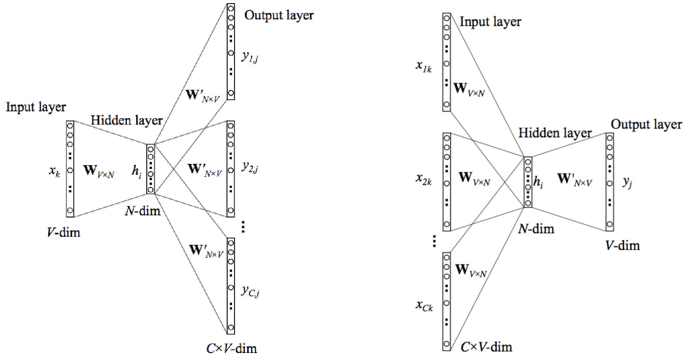

---

#### Negative Sampling

$$
J (u _ {o}, C) = \sum_ {w \in C} \exp (u _ {o} ^ {T} u _ {w}) + \sum_ {w \notin C} \exp (- u _ {o} ^ {T} u _ {w})
$$

- C is a context (set of words),

- first part is positive samples,

- second part is negative samples.
---

## 4 Evaluation of word embeddings

#### How to evaluate word vectors?

- Related to general evaluation in NLP: Intrinsic vs. extrinsic

- Intrinsic:

  - Evaluation on a specific/intermediate subtask
  - Fast to compute
  - Helps to understand that system
  - Not clear if really helpful unless correlation to real task is established

- Extrinsic:

  - Evaluation on a real task
  - Can take a long time to compute accuracy
  - Unclear if the subsystem is the problem or its interaction or other subsystems
  - If replacing exactly one subsystem with another improves accuracy ⇒ Winning!

---

#### Intrinsic word vector evaluation

- Word Vector Analogies

  $$
  \begin{array}{c} 
    \boxed{\text{a:b}:: \text{c:?}}\\
    \text {man:woman}:: \text{king:?}
  \end{array} \rightarrow
  \boxed {d=\arg\max_{i}\frac{\left(x_{b} - x_{a} + x_{c}\right)^{T} x_{i}}{\lvert x_{b} - x_{a} + x_{c} \rvert}}
  $$

- Evaluate word vectors by how well their cosine distance after addition captures intuitive semantic and syntactic analogy questions

- Discarding the input words from the search!

- Problem: What if the information is there but not linear?

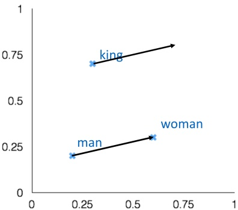

> Christopher Manning, Natural Language Processing with Deep Learning, Stanford U. CS224n

---

#### GloVe Visualizations

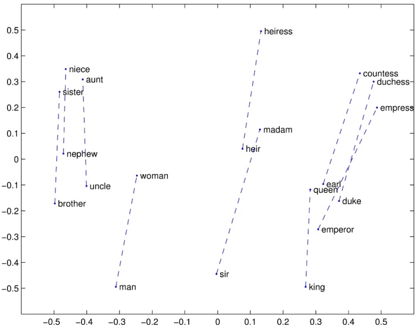

> Christopher Manning, Natural Language Processing with Deep Learning, Stanford U. CS224n

---

#### GloVe Visualizations: Company - CEO

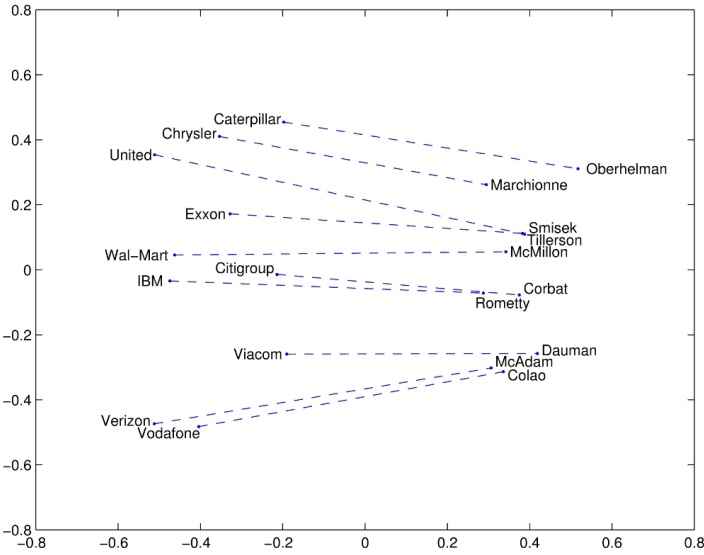

---

> Christopher Manning, Natural Language Processing with Deep Learning, Stanford U. CS224n

#### GloVe Visualizations: Superlatives

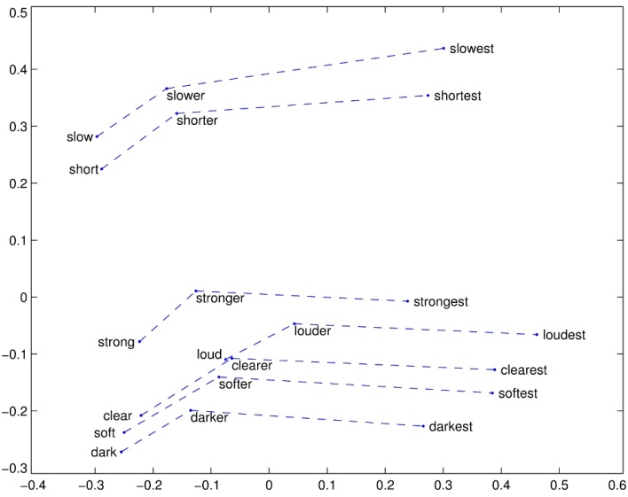

> Christopher Manning, Natural Language Processing with Deep Learning, Stanford U. CS224n

---

#### Analogy evaluation and hyperparameters

| MODEL | DIM. | SIZE | SEM. | SYN. | TOT. |
| --- | --- | --- | --- | --- | --- |
| SVD | 300 | 6B | 6.3 | 8.1 | 7.3 |
| SVD-S | 300 | 6B | 36.7 | 46.6 | 42.1 |
| SVD-L | 300 | 6B | 56.6 | 63.0 | 60.1 |
| CBOW† | 300 | 6B | 63.6 | <u>67.4</u> | 65.7 |
| SG† | 300 | 6B | 73.0 | 66.0 | 69.1 |
| GloVe | 300 | 6B | <u>77.4</u> | 67.0 | <u>71.7</u> |

Results on the word analogy task, percent accuracy

> J. Pennington, R. Socher, C. D. Manning, GloVe: Global Vectors for Word Representation, EMNLP 2014  
> 
> †: trained using the word2vec tool; underlined scores are best within the group

---

- More data helps

- Wikipedia is better than news text!

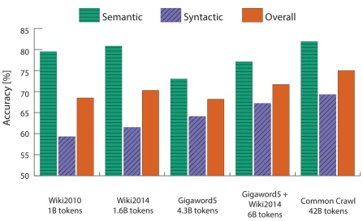

- Dimensionality

- Good dimension is ∼300

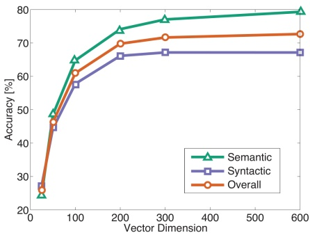

> Christopher Manning, Natural Language Processing with Deep Learning, Stanford U. CS224n

---

#### Another intrinsic word vector evaluation

- Word vector distances and their correlation with human judgments

- Example dataset: WordSim353

| WORD 1 | WORD 2 | HUMAN (MEAN) |
| --- | --- | --- |
| tiger | cat | 7.35 |
| tiger | tiger | 10 |
| book | paper | 7.46 |
| computer | internet | 7.58 |
| plane | car | 5.77 |
| professor | doctor | 6.62 |
| stock | phone | 1.62 |
| stock | CD | 1.31 |
| stock | jaguar | 0.92 |

> http://www.cs.technion.ac.il/gabr/resources/data/wordsim353/

---

### Correlation evaluation

- Word vector distances and their correlation with human judgments

  | MODEL | SIZE | WS353 | MC RG | SCWS | RW |
  | --- | --- | --- | --- | --- | --- |
  | SVD | 6B | 35.3 | 35.1 42.5 | 38.3 | 25.6 |
  | SVD-S | 6B | 56.5 | 71.5 71.0 | 53.6 | 34.7 |
  | SVD-L | 6B | 65.7 | 72.7 75.1 | 56.5 | 37.0 |
  | CBOW<sup>†</sup> | 6B | 57.2 | 65.6 68.2 | 57.0 | 32.5 |
  | SG† | 6B | 62.8 | 65.2 69.7 | 58.1 | 37.2 |
  | GloVe | 6B | 65.8 | 72.7 77.8 | 53.9 | 38.1 |
  | SVD-L | 42B | 74.0 | 76.4 74.1 | 58.3 | 39.9 |
  | GloVe | 42B | 75.9 | 83.6 82.9 | 59.6 | 47.8 |
  | CBOW<sup>∗</sup> | 100B | 68.4 | 79.6 75.4 | 59.4 | 45.5 |

  Spearman rank correlation on word similarity tasks, 300-dimensional vectors

> J. Pennington, R. Socher, C. D. Manning, GloVe: Global Vectors for Word Representation, EMNLP 2014
> 
> †: trained using the word2vec tool; ∗: from the word2vec website, contain phrase vectors

- Some ideas from the GloVe paper have been shown to improve the skip-gram (SG) model also (e.g. sum both vectors)

---

#### Extrinsic word vector evaluation

- Extrinsic evaluation of word vectors: All subsequent tasks in this class

- One example where good word vectors should help directly: named entity recognition: finding a person, organization or location

  | MODEL | ACE | DEVMUC7 | TE ACE | STMUC7 |
  | --- | --- | --- | --- | --- |
  | Discrete | 91.0 | 85.4 | 77.4 | 73.4 |
  | SVD | 90.8 | 85.7 | 77.3 | 73.7 |
  | SVD-S | 91.0 | 85.5 | 77.6 | 74.3 |
  | SVD-L | 90.5 | 84.8 | 73.6 | 71.5 |
  | HPCA | 92.6 | 88.7 | 81.7 | 80.7 |
  | HSMN | 90.5 | 85.7 | 78.7 | 74.7 |
  | CW | 92.2 | 87.4 | 81.7 | 80.2 |
  | CBOW | 93.1 | 88.2 | 82.2 | 81.1 |
  | GloVe | 93.2 | 88.3 | 82.9 | 82.2 |

---

## 5 fastText

#### Limitation of Skip-Gram

- It is difficult for good representations of rare words to be learned with traditional word2vec.

- There could be words in the NLP task that were not present in the word2vec training corpus

  - This limitation is more pronounced in case of morphologically rich languages  

    EX) In French or Spanish, most verbs have more than forty different inflected forms, while the Finnish language has fifteen cases for nouns

  ⇒ It is possible to improve vector representations for morphologically rich languages by using character level information.

---

#### Example

German verb: *sein* (English verb: *be*)

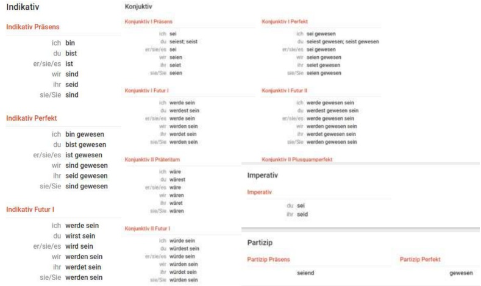

> Piotr Bojanowski, Edouard Grave, Armand Joulin, Tomas Mikolov, Enriching Word Vectors with Subword Information, slides

---

#### Character n-gram based model

- The basic skip-gram model described above ignores the internal structure of the word.

- However, character n-gram based model incorporates information about the structure in terms of character n-gram embeddings.

- This paper supposes that each word w is represented as a bag of character n-grams.

  EX) for $n = 3$, the word where is represented by the character n-grams:

  `<wh, whe, her, ere, re>`  

  and the special sequence `<where>`  

  The word `<her>` is different from the tri-gram `her` from the word *where*

---

#### Character n-gram based model (cont’d)

- We represent a word by the sum of the vector representations of its n-gram. We thus obtain the scoring function:

  $$
  s (w, c) = \sum_ {g \in \varsigma_ {w}} z _ {g} ^ {T} v _ {c}
  $$

  w: given word

  $\varsigma _ { W }$ : the set of n-grams appearing in word w

  $Z _ { g }$ : vector representation to each n-grams

  $V _ { C } ;$ the word vector of the center word C

- We extract all the n-grams. $( { \mathfrak { Z } } \leq n \leq 6 )$

  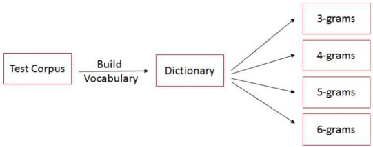

  > Piotr Bojanowski, Edouard Grave, Armand Joulin, Tomas Mikolov, Enriching Word Vectors with Subword Information, slides

---

#### Computing word vector representation

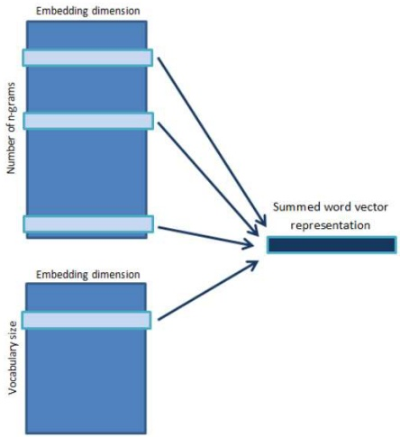

> Piotr Bojanowski, Edouard Grave, Armand Joulin, Tomas Mikolov, Enriching Word Vectors with Subword Information, slides

---

#### Experiments Settings

- Target Languages:

  - German / English / French / Spanish Arabic / Romanian / Russian / Czech

- Kind of tasks:

  1. Human similarity judgement

  2. Word analogy tasks

  3. Comparison with morphological representations

  4. Effect of the size of the training data

  5. Effect of the size of n-grams

---

#### Human similarity judgement

- Correlation between human judgement and similarity scores on word similarity datasets.

  |     |     | SG | CBOW | SISG- | SISG |
  | --- | --- | --- | --- | --- | --- |
  | Ar | WS353 | 51 | 52 | 54 | 55 |
  | De | Gur350 | 61 | 62 | 64 | 70 |
  |    | Gur65 | 78 | 78 | 81 | 81 |
  |    | ZG222 | 35 | 38 | 41 | 44 |
  | En | RW | 43 | 43 | 46 | 47 |
  |    | WS353 | 72 | 73 | 71 | 71 |
  | Es | WS353 | 57 | 58 | 58 | 59 |
  | Fr | RG65 | 70 | 69 | 75 | 75 |
  | Ro | WS353 | 48 | 52 | 51 | 54 |
  | Ru | HJ | 59 | 60 | 60 | 66 |

  SG: Skip-Gram,  
  CBOW: continuous bag of words,  
  RW: Rare Words dataset  
  SISG-: Subword Information  
  Skip-Gram (Treat unseen words as a null vector)  
  SISG: Subword Information  
  Skip-Gram (Treat unseen words by summing the n-gram vectors)

---

#### Word analogy tasks

- Accuracy of our model and baselines on word analogy tasks for Czech, German, English and Italian

  |    |           | SG   | CBOW | SISG |
  |----|-----------|------|------|------|
  | Cs | Semantic  | 25.7 | 27.6 | 27.5 |
  |    | Syntactic | 52.8 | 55.0 | 77.8 |
  | De | Semantic  | 66.5 | 66.8 | 62.3 |
  |    | Syntactic | 44.5 | 45.0 | 56.4 |
  | En | Semantic  | 78.5 | 78.2 | 77.8 |
  |    | Syntactic | 70.1 | 69.9 | 74.9 |
  | It | Semantic  | 52.3 | 54.7 | 52.3 |
  |    | Syntactic | 51.5 | 51.8 | 62.7 |

  \* It is observed that morphological information significantly improves the syntactic tasks; our approach outperforms the baselines. In contrast, it does not help for semantic questions, and even degrades the performance for German and Italian.

---

#### Comparison with morphological representations

- Spearman’s rank correlation coefficient between human judgement and model scores for different methods using morphology to learn word representations.

  |  | DE GUR350 Z | G222 | ENWS353 | RW | ESWS353 | FRRG65 |
  | --- | --- | --- | --- | --- | --- | --- |
  | Luong et al. (2013) | - | - | 64 | 34 | - | - |
  | Qiu et al. (2014) | - | - | 65 | 33 | - | - |
  | Soricut and Och (2015) | 64 | 22 | 71 | 42 | 47 | 67 |
  | SISG | 73 | 43 | 73 | 48 | 54 | 69 |

---

#### Effect of the size of the training data

- Influence of size of the training data on performance (Data: full Wikipedia dump / Task: 1. similarity task)

  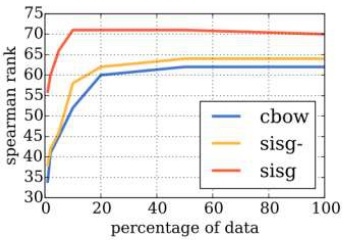

  (a) DE-GUR350

  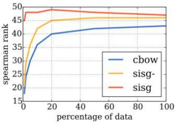

  (b) EN-RW

- Sisg model is more robust to the size of the training data.

- However, the performance of the baseline cbow model gets better as more and more data is available. sisg model, on the other hand, seems to quickly saturate and adding more data does not always lead to improved result.

- It is observed that the performance of sisg with a very small dataset is better than the performance of cbow with the full dataset.

> Piotr Bojanowski, Edouard Grave, Armand Joulin, Tomas Mikolov, Enriching Word Vectors with Subword Information, slides

---

#### Effect of the size of n-grams

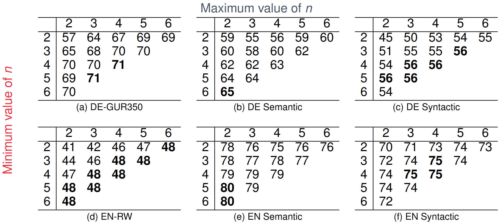

- The choice of n boundary is observed to be language and task dependent.

- Results are always improved by taking $n \geq 3$ rather than $n \geq 2$ , which shows that character 2-grams are not informative for that task.

#### Conclusion

- General Skip-Gram model has some limitations. (Ex: OOV)

- But, this can be overcome by using subword information (character n-grams).

- This model is simple. Because of simplicity, this model trains fast and does not require any preprocessing or supervision.

- It works better for certain languages. (Ex: German)

## Content

1. **Distributional semantics**

2. **Word embeddings**

3. **Word2Vec**

4. **Evaluation of word embeddings**

5. **fastText**