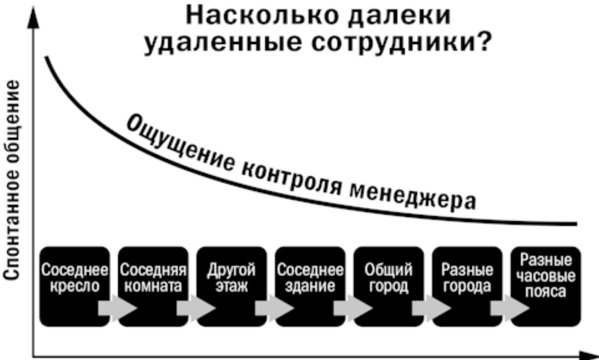
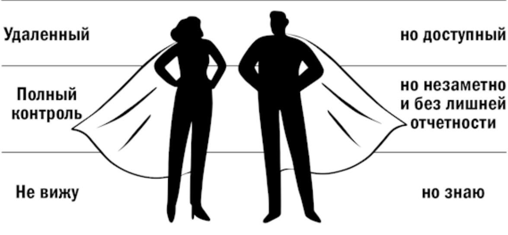

## Глава 3 Задачи и трудности дистанционного менеджера и удаленного сотрудника

### Как это видит менеджер

Как правило, первое, что приходит в голову, если задуматься о сложностях дистанционного управления, – недостаток контроля. Распространенная реакция руководителя, который задумывается о дистанционной работе или хотя бы о гибком графике, – «Как же я буду уверен, что они вообще по-прежнему работают?».

Удаленных сотрудников сложнее контролировать. Менеджер не может видеть, пришел ли сотрудник на работу, в каком он настроении, насколько он воодушевлен, замотивирован на выполнение поставленных задач.

Однако ощущение недостатка контроля не всегда связано с удаленностью.

Если сотрудник сидит на соседнем кресле в офисе, то менеджер может видеть и слышать, как он работает, внести коррективы, обменяться информацией. Высока вероятность спонтанной коммуникации: просто проходя мимо, можно перекинуться парой слов.

Если же рабочее место вашего сотрудника находится хотя бы на другом этаже или в другом здании, то он уже в какой-то мере является дистанционным сотрудником. Вы не видите, когда он пришел на работу или чем занимается прямо сейчас, не слышите, как он разговаривает с коллегами или с клиентами. Вам сложно понять, чем он занимается прямо сейчас и чем насыщен его день.

Поход в соседнее помещение займет небольшое, но время, а ожидание лифта заставит вас потерять 10–15 минут, чтобы добраться до него. Поэтому, скорее всего, вы не будете встречаться лично всякий раз, когда возникнет необходимость что-либо обсудить, а неформальное общение сократится до минимума или практически прекратится. Вполне вероятно, что встречаться с ним вы, скорее всего, будете по заранее запланированному расписанию один-два раза в неделю или реже.

По мере удаления сотрудника – в другое здание, в другой район города, в другой город, в другую страну, в другой часовой пояс – фактическая удаленность, измеряемая в километрах, возрастает линейно, а воспринимаемая – существенно быстрее. Так, сотрудник, находящийся в соседнем здании, почти так же удален от менеджера, как и его коллега, работающий в дальней части города. Поскольку возможность для спонтанного общения сильно ограничена, встречи необходимо назначать заранее. Значительная часть личных контактов начинает проходить с использованием Skype или других средств цифровой коммуникации, а то и вовсе заменяется на звонки и письма.

По воспринимаемой удаленности между сотрудником, который сидит рядом с вами, и сотрудником, который сидит за стеной, различие гораздо большее, чем между сотрудниками, находящимися за 1000 и 1500 километров от вас. Если, например, центральный офис находится в Москве, то новосибирский и хабаровский сотрудники, с точки зрения их руководства, оба являются удаленными и располагаются примерно в одной и той же локации, хотя фактически между ними тысячи километров.

Сотрудник, работающий в соседнем городе, так же ограничен в коммуникации с менеджером, как сотрудник, работающий в другом регионе: и тому и другому нужно назначать встречи и планировать их заблаговременно, а увидеться с менеджером они смогут лишь несколько раз в год.

Часто большая воспринимаемая удаленность провоцирует у руководителей паранойю в области контроля, и, чтобы успокоить ее, приходится запускать целый комплекс технологий и мероприятий по контролю: системы учета рабочего времени, слежения за экраном компьютера, видеокамеры в офисах, GPS-трекинг и т. д.

Держать сотрудников на коротком поводке, чтобы точно знать, чем они занимаются, – не лучшее решение. Ведь полный контроль (поговорим об этом в отдельной главе) довольно сложно обеспечить даже в офисе. Никакие камеры, средства слежения не заставят сотрудника думать как предприниматель, быть вовлеченным, искренне хотеть сделать работу наилучшим образом.

Тем не менее контролировать удаленных сотрудников, конечно же, нужно. Но делать это необходимо таким образом, чтобы не отвлекать от основной работы. Если у сотрудника уходит слишком много времени на отчетность, такая работа не будет продуктивной. Поэтому гораздо лучше будет организовать такую систему учета выполненной работы, которая будет давать руководителю хорошее понимание, чем занят сотрудник, а самого сотрудника будет стимулировать проявить больше осознанности и ответственности при планировании дня и выполнении пунктов плана.

В рассматриваемом примере компании «ВымпелКом» такой системой стал «ToDoлист»  – трекер задач, в который все сотрудники заносят все свои дела  – от работы с электронной почтой до выделения времени на подготовку стратегии развития. Заполнение трекера является своеобразной платой за возможность работать вне офиса. Важно, что при работе с такой системой сами сотрудники начинают лучше задумываться над тем, можно ли выполнить какую-либо задачу быстрее или другим способом, чтобы сэкономить время, а также ощущают здоровый азарт, ведь не хочется оставлять невыполненными пункты из списка.

Давайте теперь обратимся к опыту реальных руководителей, работающих в удаленном формате. Ранее я приводил пример работы Марины Белоусовой, которая руководит отделом по работе с персоналом и международными продажами в ИТ-компании «Тайле».

Вот какие вызовы удаленного руководства приводит Марина:

●  **Отсутствие возможности поговорить лично.** В личном общении есть уровень цифр и фактов, а есть уровень отношений и эмоций. Последний в дистанционной коммуникации гораздо слабее. Когда общаешься по Skype, то сложнее воодушевить человека, нельзя поговорить душевно, взять за руку, невозможно обменяться энергией. Поэтому периодически необходим физический контакт с человеком: руку пожать, по плечу похлопать, посмотреть в глаза. Накладывает отпечаток еще и работа HR-а, где в принципе необходимо много разговаривать с людьми, решать проблемы и принимать решения, их касающиеся. В такой работе много ситуаций, когда нужно работать с состоянием коллег: когда сотрудник недостаточно замотивирован или, наоборот, когда он большой молодец и его надо удержать. Такие разговоры очень сложно проводить, когда ты находишься на расстоянии. Тяжелее проводить и разговоры со сложными сотрудниками или в непростых ситуациях. Например, недавно мне необходимо было дистанционно обсудить с руководителем одного из наших филиалов сокращение штата сотрудников этого офиса. Необходимо было совершить оптимизацию расходов на персонал. В центральном офисе мы проанализировали загрузку сотрудников по их электронной переписке, количеству операций в 1С, понаблюдали по камерам и поняли, что есть резерв для «уплотнения» команды. Руководитель филиала видел ситуацию по-другому и с решением морально не был согласен. Телефонный разговор на такую щекотливую тему только подчеркнул, как далеко мы находились друг от друга во всех смыслах этого слова. Диалог получился крайне тяжелый, в результате пришлось проводить решение почти силовым путем. Если бы мы общались не удаленно, а лично, то прошло бы легче: можно было бы подключить невербалику, лучше увидеть эмоции и правильно отреагировать, пройтись где-то вместе и поразмышлять, а в результате – услышать друг друга и договориться.

● **Сложно создать атмосферу доверия и поговорить откровенно.** Иногда бывает так, что проблемы в личной жизни у сотрудника влияют на работу. И невозможно понять: работа не нравится или в семье что-то не так. При этом человек говорит: «У меня все хорошо, все в порядке». Вот такие разговоры я откладываю до личной встречи, а чтобы не забыть про все ситуации, которые необходимо обсудить, записываю их в ежедневник. Когда я руководила отделом продаж в Москве, у нас каждый месяц были очные беседы с сотрудниками: мы уходили в переговорку и общались, причем разговаривали в том числе на личные темы: дети, здоровье, путешествия, ремонт и т. д. Теперь, при переходе в удаленный формат, это становится сложнее, однако если доверие было создано и если его не разрушать нарочно, то поддерживать эту «нить» от одной редкой встречи до другой все же возможно.

● **Необходимо быть источником и проводником высокого уровня организованности и дисциплины для своих сотрудников.** Нужно быть примером: жонглировать задачами, уметь брать максимум от доступных слотов времени, выполнять свои обещания в срок, использовать современные технологии. Сами по себе сотрудники, находясь в разных городах, могут не суметь построить эффективную систему работы, а особенно такую, которая будет удобна руководителю.

Конечно, самостоятельность, организованность, способность планировать и расставлять приоритеты – это изначально важные качества для удаленных сотрудников. При этом если у человека есть хотя бы какие-то базовые навыки и желание этому учиться, то такой навык можно развивать, а вот с раздолбаями связываться не стоит. Моя практика показала, что это «не лечится».

● **Необходимо уметь требовать результат,** быть жесткой в случае необходимости, уметь давать критическую обратную связь. Если за выделенный период времени мы не в состоянии прийти к результату и соглашению, значит, мы не подходим друг другу.

У нас был печальный опыт работы с удаленным сотрудником в Венгрии. Начало было многообещающее: он пришел по рекомендации нашего местного партнера и показался сильным продавцом. Харизматичный, высокий, с модной небритостью, он был энергичен в общении и умело пускал пыль в глаза. В свои сорок с небольшим он обладал успешным опытом продаж на ИТ-рынке. Однако уровень продаж нашей продукции был очень низким и не рос в течение года. Я не могла понять, на каком этапе происходят провалы: первоначальный контакт, подготовка к встрече, закрытие сделки или что-то другое. Он не был готов принять необходимость писать какие бы то ни было отчеты, не мог подробно объяснить план своей работы, соответственно, разобраться в ситуации было невозможно. В принципе, неумение и нежелание составлять отчеты можно простить сотруднику при наличии выдающихся результатов, а с этим проблема лишь нарастала. В итоге пришлось его увольнять, а бизнес-модель в этой стране существенно перекраивать.

При найме мы лично не встречались, однако, скорее всего, даже очное собеседование не решило бы проблему с конкретно этим человеком. Я сделала вывод, что успех в продаже одного бренда абсолютно ничего не гарантирует при продаже другого бренда и при работе в другой компании. У того сотрудника был свой контекст, и в том контексте он был успешным продавцом. После того, как контекст изменился, человек оказался абсолютно неуспешным, даже его бывшие клиенты к нам не пришли. Что касается рекомендаций, то люди, которые рекомендуют, имеют перед глазами картинку, как этот человек работал в прошлом, и не факт, что эта ситуация повторится у нового работодателя.

Марина привела ряд важных и частых проблем, беспокоящих дистанционных руководителей. При этом практически каждый аспект регулярных практик менеджмента имеет определенную специфику при выполнении его в дистанционном формате. В начале главы уже описана ситуация с контролем. А что кроме этого?

● Дистанционному сотруднику сложнее передать задачу.

Разумеется, задачу можно написать в чате или отправить по электронной почте, позвонить. Но сложно определить, хорошо ли сотрудник понял, что от него требуется, достаточно ли сотрудник вовлечен, можно ли ожидать, что он поставленную задачу успешно выполнит.

● Предоставляемая по результатам выполнения (или невыполнения) задачи обратная связь часто становится слишком формальной или вообще теряется. В результате руководитель не получает нужного результата, а сотрудник чувствует себя брошенным.

● Дистанционному менеджеру может недоставать мотивирующих инструментов. Воодушевить сотрудника на трудовые подвиги гораздо легче при непосредственном общении, когда можно обменяться эмоциями, похлопать по плечу, увидеть его выражение лица и вовремя подобрать нужные слова. Особенно сложно дистанционно передавать моменты, касающиеся сервиса и качественного обслуживания клиентов.

В следующих главах мы подробнее рассмотрим эти особенности работы в дистанционном формате.

А теперь давайте посмотрим на мир глазами самого удаленного сотрудника, ведь и для него дистанционная работа также сопряжена с определенными особенностями. Каковы же сложности удаленной работы для сотрудников?

### Как это видит сотрудник

### Я работаю… совсем удаленно

Рабочий день Джамилы Керимовой начинается в 7 утра по времени Лиона, где она сейчас живет. Она открывает MacBook и до 11 часов занимается поддержкой системы дистанционного обучения «ВымпелКома»: управляет работой команды проектировщиков новых курсов, публикует их, настраивает права доступа и т. д.

После 11 с компьютером под мышкой она отправляется из Лиона в соседний городок Сент-Этьен, чтобы попасть на занятия в магистратуре Школы инженеров новых технологий (Télécom Saint-Etienne).

Джамила Керимова относится к числу сотрудников, работающих в программе BeeFREE полностью вне офиса. Она работает настолько вне офиса, что смогла переехать в другую страну, чтобы продолжить образование.

Джамила работает на половину ставки, оставаясь штатным сотрудником компании. Часовая разница помогает везде успеть: время с 7 до 11 во Франции соответствует интервалу с 9 до 13 по московскому времени, так что до начала занятий вполне можно выполнить рабочие задачи. Понятно, что в сложных ситуациях придется вернуться к работе вечером, если в этом появится необходимость.

История Джамилы нетипична, ведь ей необходимо было провести значительную работу как внутри компании, убеждая руководителей в том, что она сможет эффективно работать в подобном формате, так и вне ее: необходимо было выбрать вуз, подготовить многочисленные документы, получить учебную визу и т. д. Кроме того, работать в таком формате Джамила сможет около 9 месяцев, а потом будет вынуждена уволиться, чтобы получить возможность стажироваться во французской компании.

Оказавшись в экстремально удаленной ситуации, Джамила очень четко понимала всю серьезность основных вызовов удаленного сотрудника.

**Первый вызов  – необходимость самостоятельно организовать и полностью поддерживать свое рабочее место.**

Вот что она говорит: «Работая удаленно, ты не можешь подойти к коллеге и задать какойто бытовой вопрос. Если компьютер сломается совсем, то не будет возможности оперативно обратиться в службу поддержки и решить проблему. Это значит, что собственный уровень технической подготовки должен быть достаточно высоким и нужно уметь самостоятельно решить бытовые технические задачи: подключение к интернету, подключение оборудования, VPN и т. д.».

**Второй вызов – коммуникация с коллегами.**

Дистанционный сотрудник – последний человек, до которого доходят социальные новости: когда кто-то из коллег ушел в декрет или вышел замуж. Немного помогает решить эту ситуацию группа в WhatsApp, где появляются самые срочные новости, однако общение по этому каналу редко бывает полноценным и структурированным.

«Зачастую не хватает общения с командой, частью которой я являюсь. Но индивидуально со своими коллегами и сотрудниками я общаюсь достаточно, – говорит Джамила. – От работы осталась квинтэссенция работы – нет общения у кулера, нет офисных сплетен и праздных бесед с коллегами, нет долгих телефонных звонков, а осталась собственно работа, которую я еще и концентрирую, чтобы все успеть».

Удаленным сотрудникам может не хватать общения, теплоты, неформальной коммуникации, возможности пожать руку коллегам, обменяться корпоративными историями или даже сплетнями. Такая социализация очень часто является одним из мотиваторов, ведь, попадая в офис, люди могут почувствовать себя частью общества, самовыразиться. При работе из удаленного офиса, в отрыве от своей команды, а особенно при работе из домашнего офиса этот компонент теряется.

Для склонных к интроверсии или выполняющих такие задачи, где надо сосредоточиться, сотрудников этот же фактор является преимуществом. Очень часто, проводя интервью, я слышал: «Дома меня никто не отвлекает», «На работе коллеги часто подходят спросить что-то, сбивают с мысли», «В собственном пространстве мне легче сосредоточиться».

Очевидно, что план коммуникации с удаленной командой должен быть выверен и сбалансирован, чтобы, с одной стороны, обеспечивать достаточный обмен информацией и эмоциями, а с другой – давать возможность сосредоточиться.

**Третий вызов – поддержка высокой эффективности работы.**

«Когда я сократила часы работы вдвое, я не стала работать в два раза меньше по времени; стало очевидно, что раньше я работала больше 8 часов. Находясь в Москве, я могла и вечером задержаться, и в субботу на мероприятие сходить, чтобы поддержать коллег; это был не рабочий день, а рабочая жизнь, занимающая все свободное время.

Сейчас я работаю 4–4,5 часа в день и просто не могу выделить больше времени, потому что надо успеть и на учебу тоже. Это дополнительный вызов, который заставляет задавать себе вопросы типа “А можно ли это сделать более эффективно?”, “А можно ли не делать этого вовсе?”.

Например, я предпочту не собирать встречу на 1,5 часа для обсуждения вопроса по новому курсу, а заменю это обсуждение голосованием в Google-форме. Так коллеги смогут высказаться в удобное им время, а я получу готовые результаты, затратив на это не 1,5 часа, а 5 минут на создание формы и 10 минут на знакомство с результатами. Это будет удобнее не только для меня, но и для всех. Эффективность получается та же самая, но способ решения совершенно другой, и затраченное время гораздо меньше».

Джамила приводит и одно из частых опасений дистанционных сотрудников: а будет ли завтра эта дистанционная работа? Вдруг руководство примет решение не продлевать эти условия BeeFREE? Как правило, удаленные сотрудники чувствуют себя менее защищенными, чем те, кто ходит в офис.

Еще один наш герой – Мария Гурьева, она также работает в «ВымпелКоме» и участвует в программе BeeFREE с самого начала проекта. Мария – менеджер по внутренним коммуникациям, поэтому ей необходимо часто общаться с внутренними клиентами, в связи с чем сама идея удаленной работы выглядит немного странно. Вот какие опасения, звучавшие на ранних стадиях проекта, она приводит (надо сказать, что большинство из этих опасений были решены в ходе проекта).

***Как это можно не видеть внутреннего клиента?***

У меня самой не было сопротивления, но было непонятно, как это я не буду лично общаться с людьми, с которыми работаю, ведь такое общение – это важная часть моей работы. Нужно постоянно видеть внутренних клиентов.

***Смогу ли я организовать рабочее пространство дома?***

У нас в офисе был свой креативный уголок, где было много цветов, всяких няшечек, мягких игрушек, ярких вещей, куча картинок и т. д., – такое креативное пространство.

Когда нам сказали, что грядет политика чистого стола, все нужно убрать, унести домой, сначала был шок. Как, как это у нас не будет рабочего места?! Кто-то говорил, что дома двое детей, бабушка в квартире живет и т. д.

***Возможность сосредоточиться.***

Я сильно переживала, что могу отвлекаться на домашние вещи, на дом, на кошку. Впоследствии я столкнулась с обратной ситуацией. Я садилась с утра за рабочий стол и находилась в потоке работы даже в тот момент, когда в 7 вечера приходил с работы муж, даже не отвлекаясь, чтобы открыть ему дверь.

***Установление рабочего графика.***

У тебя складывается ощущение, что раз ты дома и можешь делать собственные дела в небольшие промежутки времени, то ты что-то недоделала. Поэтому если пришло письмо в 10 вечера, то хочется сразу на него ответить. В какой-то момент, когда эта воронка уже затянула немного, я поняла, что надо этот режим как-то перестраивать, нужно отключаться от работоголизма и учить себя выстраивать график.

Как же решались все эти проблемы?

Поскольку Мария работает удаленно только несколько дней в неделю, ей (как и многим другим участникам проекта BeeFREE) удалось выработать очень органичный и удобный ритм: 2–3 офисных дня в неделю посвящены общению с коллегами, совещаниям и презентациям, а для того, чтобы подготовить тексты, создать рассылки и т. д., то есть провести такую работу, которая требует концентрации, хорошо подходят 2–3 дня работы вне офиса.

Как выяснилось, домашнее пространство вполне подходит для того, чтобы сосредоточиться: сотрудников привлекает возможность мигрировать между рабочим столом, диваном и подоконником: «Когда ты выполняешь творческую работу, нужно как-то походить, так присесть, сяк присесть, покрутиться, а в офисе этого никак не сделать. Там сидишь за столом прямо».

С установлением рабочего графика и согласованием офисных и внеофисных дней помогают «ToDo-лист» и система планирования, в которой всегда можно посмотреть, на какой день удобнее назначить встречу в офисе, чтобы могли собраться все, кто нужен.

Другие участники интервью и тренингов, смотря на мир глазами сотрудника, часто приводили следующие сложности удаленной работы:

●  **Сложность оперативного взаимодействия с руководителем.** Например, если у сотрудника возникает желание обсудить какие-либо проблемы с менеджером, а тот находится в другом часовом поясе, получается вынужденная задержка на несколько часов, а то и на день. Даже если вы находитесь в одном часовом поясе, но в разных местах, нет возможности подойти лично, чтобы обсудить проблему.

●  **Нечеткое распределение ответственности.** Сотруднику может быть непонятно, где находится граница его полномочий: какие решения он должен принимать сам, а какие эскалировать менеджеру. Удаленная работа изначально предполагает большую самостоятельность и независимость сотрудника, однако бывает и так, что сотрудники не хотят брать на себя дополнительные полномочия и ответственность, а бывает так, что менеджер не хочет их отдавать и терять контроль над ситуацией.

● **Видит ли руководитель мою работу?** Донесение результатов своей работы до менеджера превращается для удаленного сотрудника в отдельную задачу. Не всегда очевидно, заметит ли руководство его старания (и можно ли немного расслабиться).

●  **Не хватает обратной связи.** Удаленный сотрудник может не понимать, заметил ли менеджер его работу и доволен ли ее выполнением. От недостатка обратной связи у сотрудника может развиваться ощущение пустоты, вакуума. К тому же он не видит и своих коллег.

●  **Участникам виртуальных команд часто не хватает чувства локтя.** Поэтому построить командную работу между удаленными сотрудниками может быть гораздо сложнее, чем при очной работе.

●  **Усиливаются проблемы матричного руководства.** Частой проблемой является ситуация, когда при работе в матричной структуре у сотрудника есть прямой и функциональный менеджеры и у каждого свое понимание текущих задач, приоритетов и правильности выполнения работы.

Таким образом, дистанционная работа предъявляет дополнительные требования не только к менеджеру, но и к сотруднику.

**Менеджер в этой ситуации должен стать своеобразным «супергероем»  – соответствовать нескольким взаимоисключающим требованиям.**

●  Он должен быть доступным для сотрудников, иметь возможность достаточно частого контакта.

●  Должен отслеживать задачи, качество и сроки работы сотрудников, проверять соблюдение дедлайнов. При этом контроль должен осуществляться максимально ненавязчиво и незаметно, без лишней отчетности, чтобы работа сотрудника не превращалась в пытку заполнением бесконечных форм.

● Не видя сотрудников, менеджер должен быть с достаточной полнотой вовлечен в их работу, точно знать, чем именно они занимаются, какие у них сложности и проблемы.

Появляется и ряд специфических требований к сотруднику: умение организовывать свою работу, планировать собственный день, концентрироваться и работать без окружающего коллектива. Подробнее о требованиях к удаленным сотрудникам я расскажу в главе про подбор кадров.